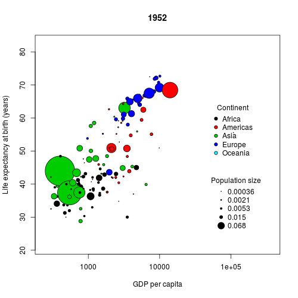

# Animations {#animation}

> **Important**: If you are doing this on your own machine, you will need to install a piece of software called [ImageMagick](https://www.imagemagick.org/script/index.php). The necessary binaries can be downloaded [here](https://www.imagemagick.org/script/download.php#windows); make sure you download the correct version for your operating system. If you are installing the Windows version, you must ensure that you tick the box labelled "Install legacy utilities (e.g. convert)" during the installation process---see Figure \@ref(fig:imagemagick).
>  
> ```{r, imagemagick, fig.cap = "Imagemagick installation screen"}
> 
> ```
> Once installed, the rest of the code below should run accordingly. (I haven't checked this on a Mac, but on my Linux box I could install ImageMagick through the default package manager.)

> **Note**: The University machines have been installed without the legacy files, which means that the binary 'convert.exe' that is required to produce the animations is not available. One workaround is to set the global option 
> ```{r eval = F}
> ani.options(convert = 'C:/Program Files/ImageMagick-7.0.4-Q16/magick.exe')
> ```
> Once this is run then the animations should work. **Note also**: If running on your own machine you might need to replace the `C:/Program Files/ImageMagick-7.0.4-Q16/magick.exe` path with the correct path to the 'magick.exe' file on your own machine.

[Yihui Xie]((https://yihui.name/en/)) (of `knitr` fame) and colleagues have also produced the neat [`animation`](https://cran.r-project.org/web/packages/animation/) package, that enables animations to be produced from R. In essence we simply need to write a loop that produces different static plots, which can then be bound together by the `animation` package. Firstly, install the `animation` package if need be:

```{r, eval = F}
install.packages("animation")
```

Next, load the package:

```{r, cache = F}
library(animation)
```

Now produce an animated GIF as follows:

```{r, results = "hide", message = F}
saveGIF({
    ## function to produce multiple plots
    ## which get bound together as a GIF
    for(i in sort(unique(gapminder$year))){
        plotGapminder(gapminder, i)
    }
}, movie.name = "gapminder.gif", 
    ani.width = 500, ani.height = 500,
    interval = 0.5)
```

```{r, echo = F}
if (knitr:::is_latex_output()) {
    plotGapminder(gapminder, 1952)
} else {
    
}
```

> This function is slightly strange. The first argument is an R expression that generates multiple plots, which `saveGIF` then binds together. The other arguments relate to things like the size of the output file and how fast it skips between plots.

```{task}
Understand what the code inside the `saveGIF()` function is doing. Try making the animation slower.
```

```{solution}

``{r, eval = F}
## change the interval argument to slow animation down
saveGIF({
    ## function to produce multiple plots
    ## which get bound together as a GIF
    for(i in sort(unique(gapminder$year))){
        plotGapminder(gapminder, i)
    }
}, movie.name = "gapminderslow.gif", 
    ani.width = 500, ani.height = 500,
    interval = 1)
``

```

> **Note**: The `animation` package in R will also produce animations saved in other formats. For example, `saveHTML` will produce a HTML presentation, or `saveVideo` to save into .mp4 format. Sometimes these are preferable to GIF animations, because they can be interacted with (i.e. paused, stopped etc.). The `saveVideo` function requires an external package called [ffmpeg](https://ffmpeg.org/) to be installed. It works nicely enough on Linux, but I haven't tried it on Windows. I'm happy to try to help if any of you want to try this on your own machines, and run into any difficulties.

> **Update**: I *think* ffmpeg might be installed as part of ImageMagick. But don't quote me...

> **Inclusion in R Markdown**: these animations can also be included in R Markdown documents. The easiest way is to write a code chunk that saves into an external file, and then embed the file into the document. For example, the section above this with the R code to produce the GIF, followed by the animation was created with the following R Markdown code:
> ```{r, comment = NA, echo = F}
> cat("```{r, results = \"hide\", message = F}
> saveGIF({
>     ani.options(interval = 0.5, nmax = 50)
>     
>     for(i in sort(unique(gapminder$year))){
>         plotGapminder(gapminder, i)
>     }
> }, movie.name = \"gapminder.gif\", 
>       ani.width = 600, ani.height = 600)
> ``` \n
> ")
> ```
> Notice the options `results = "hide"` to make sure the chunk is run (in order to produce the GIF), but to *hide* any outputs, and the option `message = F` to suppress the output message that `saveGIF` automatically prints. This creates a file called "gapminder.gif" in the working directory, which we embed into the HTML output in the standard way for external figures, using the syntax ``---see the [R Markdown Cheat Sheet](https://www.rstudio.com/wp-content/uploads/2016/03/rmarkdown-cheatsheet-2.0.pdf).

> **Note**: this animation is not perfect, some points overlap the legends, and we'd be better off placing the legend in the outer margins of the plot and amending accordingly. The colours are also fairly garish, and perhaps using a more subtle palette would be better. R's base graphics system is **incredibly** flexible, but can often require a lot of work to generate complex plots. Next, we introduce a package written specifically for visualising data sets.
