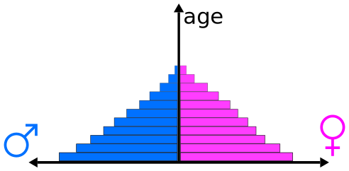

# Data Wrangling

It is estimated that data scientists spend around [50-80% of their time cleaning and manipulating data](https://www.nytimes.com/2014/08/18/technology/for-big-data-scientists-hurdle-to-insights-is-janitor-work.html?_r=0). This process, known as **data wrangling** (or **data munging**) is a key component of modern statistical science, particularly in the age of **big data**. We have already seen some examples of cleaning, manipulating and summarising data using some of R's core functions, here we introduce a set of tools that have been designed to work together to produce more fluid and readable code.

The team behind `ggplot2` have also put together various packages that provide functionality for doing common data wrangling tasks, such as transforming "wide" (or "messy") data into "long" (or "tidy") data, summarising, grouping, filtering and so on. Many if these operations can be achieved relatively straightforwardly using R's core functionality, however the code can often be non-trivial to decipher. The `tidyr` and `dplyr` packages we installed earlier, are an attempt to make common data wrangling tasks not only easier to achieve, but also easier to decipher. **Readability** of the code being a core ideal in the philosophy underpinning the packages. In the case of `dplyr`, several of the functions are substantially faster than the native R versions.

As usual with R, there are usually many ways to achieve the same outcome. These examples show how some common tasks can be achieved using `tidyr` and `dplyr`.

> Great resources are the [Data Import Cheat Sheet](https://github.com/rstudio/cheatsheets/raw/master/source/pdfs/data-import-cheatsheet.pdf) and [Data Transformation Cheat Sheet](https://github.com/rstudio/cheatsheets/raw/master/source/pdfs/data-transformation-cheatsheet.pdf), which give lots of inofrmation about the `tidyr` and `dplyr` functions.

Let's pull up some data. You should have access to a .csv file called "indicator gapminder gdp_per_capita_ppp.csv" on ELE. This is a digital download of the [Gapminder](https://www.gapminder.org/) GDP per capita data that can be found in the `gapminder` package. All the data sets used in the [Gapminder](https://www.gapminder.org/) project can be downloaded from [https://www.gapminder.org/data/](https://www.gapminder.org/data/).

Download this file and save it into your working directory. To start with, we will load the data into R and go through the steps to clean it up individually. Afterwards, we will use some neat features of `tidyr` and `dplyr` to do this much more succinctly.

Firstly, let's load the packages we need:

```{r, message = F}
library(tidyr)
library(dplyr)
library(tibble)
library(ggplot2)
```

First, read in the data and convert it into a `tbl` object for ease of visualisation:

```{r}
gp_income <- read.csv("indicator gapminder gdp_per_capita_ppp.csv", header= T)
gp_income <- as_tibble(gp_income)
gp_income
```

We can see that this is in "wide" format. The first column contains the country names, and the other columns correspond to each year. The first column is labelled incorrectly as `GDP.per.capita` (this is an artefact from the original data set), so let's rename the first column using the `rename()` function:

```{r}
gp_income <- rename(gp_income, country = GDP.per.capita)
gp_income
```

Notice that the `rename()` function takes a `data.frame` / `tbl` object as its first argument, amends the column names and then passes a `data.frame` / `tbl` object out as its return value. We then overwrite the original data frame to keep our workspace neat.

> **Note**: this is OK here because we have a copy of our **raw** data saved in an external file. This, combined with the use of **scripts**, means we have a backup of the original data in case anything goes wrong. Don't overwrite your original data set!

The next thing we need to do is to collapse the **year** columns down. Ideally we want a column corresponding to **country**, a column corresponding to **year** and a final column corresponding to **GDP**. We saw in a previous practical that we can do this using the `gather()` function in `tidyr`. In the earlier example we collapsed **all** columns down. Here we wish to only collapse those corresponding to **years**. We can do this by adding some additional arguments to `gather()`: 

* `key` gives the name of the column that will contain the collapsed column names (e.g. `X1800`, `X1801` etc.);
* `value` gives the name of the columns that will contain the **values** in each of the cells of the collapsed column (e.g. the corresponding GDP values);
* the final set of arguments correspond to those columns we wish to collapse. Here we want to collapse everything ***except*** `country`, which we can do using the `-` operator.

> **Note**: `tidyr` and `dplyr` functions tend to always take a `data.frame` object as their first argument, therefore the authors have written the functions such that we do not need to use quotes `""` around column names (e.g. `"year"`, `"country"` etc.)

```{r}
gp_income <- gather(gp_income, key = year, value = gdp, -country)
gp_income
```

Great! This is what we're looking for! Notice that R has left the new `year` column as a `character` vector. R will not take numbers as column names, and so R prepends the years with an `X`; so `"1800"` becomes `"X1800`" and so on. Fortunately we are able to remove this extraneous `X` using a function in R called `gsub()`, which simply searches for a given pattern within each element of a character vector, and replaces it with something else. Hence the command `gsub("X", "", gp_income$year)` would search for the pattern `"X"` in each element of the vector `gp_income$year`, and replace it with an empty string `""`. Once the `"X"` is removed we can turn the `character` vector into a `numeric` vector:

```{r}
gp_income$year <- gsub("X", "", gp_income$year)
gp_income$year <- as.numeric(gp_income$year)
gp_income
```

> **Note** that `dplyr` provides a `mutate()` function that will do this also, and in fact we will use this later on: `gp_income <- mutate(gp_income, year = as.numeric(gsub("X", "", year)))`. Please see the [Data Wrangling Cheat Sheets](https://www.rstudio.com/resources/cheatsheets/) for more information.

This is almost there now, there is quite a lot of extraneous information in the data. Firstly, there were some mostly empty rows in Excel, which manifest as a country called `""` when the data were read into R (see the first element below---I am only printing the first few entries for brevity):

```{r}
head(levels(gp_income$country))
```

We can examine these rows by subsetting. A command `gp_income[gp_income$country == "", ]` would extract these rows, but I will use a `dplyr` function called `filter()` to do the same thing (it will become clearer why later on).

```{r}
summary(filter(gp_income, country == ""))
```

We can see from the summary that only one row has any GDP information, and indeed in the original data there was a single additional point that could be found in cell HE263 of the original Excel file. I think this is an artefact of the original data, and as such we will remove it here:

```{r}
gp_income <- filter(gp_income, country != "")
```

We can also remove the rows that have no GDP information if we so wish (which are denoted by **missing values**---`NA`):

```{r}
gp_income <- filter(gp_income, !is.na(gdp))
```

Finally, we will restrict ourselves to looking at the data from 1990 onwards:

```{r}
gp_income <- filter(gp_income, year > 1990)
summary(gp_income)
```

One final thing to note is that when we removed the `country` values above, the `levels` of the `factor` remained the same. R simply says there are no entries with the level `""`. A useful function called `droplevels()` will go through each `factor` column in a `data.frame` and reset the levels accordingly.

```{r}
gp_income <- droplevels(gp_income)
summary(gp_income)
```

Phew! this took some effort, but we've managed to end up with a fairly clean data set that we can plot, summarise etc. Before we do that, I'm going to introduce you to a feature of `tidyr` and `dplyr` that can make our code much more **succinct**.

### Pipes (`%>%`)

You will notice that I chose to use functions such as `filter()` and `mutate()` above, when I could have just extracted the correct column of the data, done the appropriate manipulation, and then overwrote the column. Why then, did I choose to use these functions?

The key aspect that these functions share is that they take a `data.frame` as their first argument, and return a `data.frame`. Whilst this may not seem useful, this means that we can use **pipes** to make our code more succinct.

> **Aside**: piping comes from Unix scripting, and simply means a chain of commands, such that the results from each command feed into the next one. 

Recently, `tidyr` and `dplyr` have introduced the pipe operator `%>%` that enables us to chain functions together. Let's look at an example:

```{r}
gp_income %>% filter(year == 1991)
```

> **Notice**: when we did this before we would write something like `filter(gp_income, year == 1991)` i.e. we required the first argument of `filter()` to be a `data.frame` (or `tbl`). The pipe operator `%>%` does this automatically, so the outcome from the left-hand side of the operator, is passed as the ***first*** argument to the right-hand side function. This makes the code more succinct, and easier to read (because we are not repeating pieces of code).

Pipes can be chained together multiple times e.g. 

```{r}
gp_income %>% filter(year == 1991) %>% summary
```

Notice that if a function ***only*** requires one argument (such as `summary()`), then I do not even need the brackets on the end. To do our previous data cleaning using pipes, we can write:

```{r}
gp_income <- read.csv("indicator gapminder gdp_per_capita_ppp.csv", header= T)

gp_income <- gp_income %>%
                as_tibble %>% 
                gather(year, gdp, -GDP.per.capita) %>%
                mutate(year = as.numeric(gsub("X", "", year))) %>%
                rename(country = GDP.per.capita) %>%
                filter(country != "") %>%
                filter(!is.na(gdp)) %>%
                filter(year > 1990) %>%
                droplevels
```

I think this is neat! The code is written in a way that is much easier to understand, each part of the data wrangling process is chained together in an intuitive way (once you know the `tidyr` and `dplyr` functions of course). Try doing the same level of data cleaning in Excel as easily...

> **Note**: in the code above we pass the result of the right-hand side out and overwrite the object `gp_income` using the assignment operator `<-` as we have previously done. The pipes have to be at the end of each line if you want to break the code across multiple lines, else R will think the pipeline has ended before it has.

Once we've got our head around pipes, we can begin to use some of the other useful functions in `dplyr` to produce summaries, for example, we might want to produce a mean GDP for each country, averaging over years. In this case we can think of "grouping" the data by country and then averaging the GDP values within each group. Hence,

```{r}
gp_income %>% 
    group_by(country) %>%
    summarise(mean(gdp))
```

The `summarise()` function (note, this is different to the `summary()` function), applies a function to a `data.frame` or subsets of a `data.frame`. Think of it a bit like the `tapply` function we saw in the first practical. Here we grouped the data frame according to country, and then ask for a `mean()` average of the `gdp` values (which here corresponds to averaging across the years).

We could do the same across the years:

```{r}
gp_income %>% 
    group_by(year) %>%
    summarise(mean(gdp))
```

We must be a bit careful here, since we may have less samples for some countries/years than for others. This affects the uncertainty in our estimates, though it is not too difficult to extract standard errors for each grouping and thus produce confidence intervals to quantify which estimates are more uncertain than others (which we will do in the Statistical Modelling modules in future years).

Please take a look at the [Data Wrangling Cheat Sheets](https://www.rstudio.com/resources/cheatsheets/).

```{task}
Load in the file "indicator hiv estimated prevalence% 15-49.csv" that can be found on ELE. This file contains the estimated HIV **prevalence** in people of age 15--49 in different countries over time. **Prevalence** is defined here to be the estimated number of people living with HIV per 100 population. Produce a **tidy** data set called `gp_hiv` using the tools in `tidyr` and `dplyr` that we introduced above. The dataset needs to run from 1991 onwards, and we want to end up with columns `country`, `year` and `prevalence`.
```

```{solution}

``{r, echo = -3}
gp_hiv <- read.csv("indicator hiv estimated prevalence% 15-49.csv", header= T)
gp_hiv <- gp_hiv %>%
                tbl_df %>% 
                gather(year, prevalence, -Estimated.HIV.Prevalence.....Ages.15.49.) %>%
                mutate(year = as.numeric(gsub("X", "", year))) %>%
                rename(country = Estimated.HIV.Prevalence.....Ages.15.49.) %>%
                filter(country != "") %>%
                filter(!is.na(prevalence)) %>%
                filter(year > 1990) %>%
                droplevels
saveRDS(gp_hiv, "gp_hiv.rds")
``

```

### Joins

We now have two data sets: `gp_income` and `gp_hiv`. In order to visualise and analyse them, we need to link them together. A key skill to have in data manipulation is the ability to **join** data sets (or tables) together. The `dplyr` package provides various functions to do this, depending on ***how*** you want to join the tables.

> In case you haven't managed to complete the last task, the `gp_hiv` data is available on ELE as "gp_hiv.rds". You can read this into R and continue with the practical.

In order to join two tables, you must have one or more variables **in common**. In this case we want to match by `country` and `year`, to produce a data set that contains `country`, `year`, `gdp` and `prevalence`.

There should be *at most* one entry for each `country` $\times$ `year` combination. We can check this using the `count()` function in `dplyr`:

```{r}
count(gp_income, country, year) %>% summary
count(gp_hiv, country, year) %>% summary
```

> `count()` counts the numbers of entries in each combination of the provided variables: in this case `year` and `country`. The `summary()` function is to provide a straightforward way to see that all the `country` $\times$ `year` combinations have one entry only.

This should make it straightforward to join. Hence,

```{r}
gp <- inner_join(gp_income, gp_hiv, by = c("year", "country"))
gp
```

Notice, this gave us a warning:

```
Warning in inner_join_impl(x, y, by$x, by$y, suffix$x, suffix$y): joining
factors with different levels, coercing to character vector
```

This means that there were some countries that were present in one data set but **not** the other (hence the `factor`s had different `levels`). R sorted this out by converting the `country` variable to a `character` (thus stripping away the level information). To have a look at where they differ, we can use either `semi_join()` or `anti_join()` (please see [Data Transformation Cheat Sheet](https://github.com/rstudio/cheatsheets/raw/master/source/pdfs/data-transformation-cheatsheet.pdf)). The function `anti_join(gp_income, gp_hiv, by = c("year", "country"))` will return all rows of `gp_income` that can't be matched to `gp_hiv`:

```{r}
anti_join(gp_income, gp_hiv, by = c("year", "country"))
anti_join(gp_hiv, gp_income, by = c("year", "country"))
```

We can see that there are `r nrow(anti_join(gp_income, gp_hiv, by = c("year", "country")))` entries present in `gp_income` that can't be matched to `gp_hiv`, but `r nrow(anti_join(gp_hiv, gp_income, by = c("year", "country")))` entries in `gp_hiv` that can't be matched to `gp_income`. 

### Types of join

> **Inner joins** return ***only*** those rows that can be matched in both data sets, it discards any rows from either data frame that can't be matched.

> **Outer joins** retain rows that don't match, depending on the type of join. **Left** outer joins retain rows from the left-hand side that don't match the right, but discard rows from the right that don't match the left. **Right** outer joins retain rows from the right-hand side that don't match the left, but discard rows from the left that don't match the right. **Full** outer joins return all rows that don't match. R uses missing values (`NA`) to fill in gaps that it can't match. For example,
> ```{r}
> left_join(gp_income, gp_hiv, by = c("year", "country"))
> ```
> Here we can see that there is no prevalence data for `Afghanistan` in `1991`, so R has included the row but with a missing value (`NA`) in place of the prevalence data. In the `inner_join` above, this row was removed. Try exploring **right-** and **full-** outer joins.
> ```{r}
> right_join(gp_income, gp_hiv, by = c("year", "country"))
> full_join(gp_income, gp_hiv, by = c("year", "country"))
> ```
> What do you notice about the **left-** and **full-** outer joins here? Why is this so?

We want to plot HIV prevalence against GDP per capita, and so an **inner join** is sufficient here.

> There is a great cheat sheet for joining that I found [here](http://stat545.com/bit001_dplyr-cheatsheet.html).

Hopefully we have now cleaned two data sets, merged them together and can now proceed with visualising them.

```{task}
Using `ggplot2`, produce a plot of HIV prevalence in 15-49 year olds against $\log_{10}$ (GDP per capita) for 1991, 1997, 2005 and 2011, where each point represents a `country`.
```

```{solution}

``{r}
## here is one solution using filtering, piping and faceting
gp %>%
    filter(year == 1991 | year == 1997 | year == 2005 | year == 2011) %>%
    mutate(year = factor(year)) %>%
    ggplot(aes(x = gdp, y = prevalence)) +
    geom_point() + 
    scale_x_continuous(trans = "log10") +
    xlab("GDP per capita") +
    ylab("HIV prevalence in 15-49 year olds") +
    facet_wrap(~year)
``

```

```{task}
Total population data are available in the "indicator gapminder population.csv" document on ELE. Load this into R, tidy it up, and then join it to the `gp` data you have already created.
```

```{solution}

``{r}
## read in data
gp_pop <- read.csv("indicator gapminder population.csv", header= T)

## tidy data
gp_pop <- gp_pop %>%
                tbl_df %>% 
                gather(year, pop, -Total.population) %>%
                mutate(year = as.numeric(gsub("X", "", year))) %>%
                rename(country = Total.population) %>%
                filter(country != "") %>%
                filter(!is.na(pop)) %>%
                filter(year > 1990) %>%
                droplevels

## check no population data are missing
## hence all rows of gp can be matched
anti_join(gp, gp_pop, by = c("year", "country"))

## join to gp table
gp <- inner_join(gp, gp_pop, by = c("year", "country"))
``

```

```{task}
Produce a new plot of HIV prevalence against GDP per capita for 1991, 1997, 2005 and 2011, where each point represents a `country` and where the point sizes are scaled by population size.
```

```{solution}

``{r}
## here is one solution using filtering, piping and faceting
gp %>%
    filter(year == 1991 | year == 1997 | year == 2005 | year == 2011) %>%
    mutate(year = factor(year)) %>%
    ggplot(aes(x = gdp, y = prevalence, size = pop)) +
    geom_point() + 
    scale_x_continuous(trans = "log10") +
    guides(size = guide_legend(title = "Population size")) +
    xlab("GDP per capita") +
    ylab("HIV prevalence in 15-49 year olds") +
    facet_wrap(~year)
``

```

# Example---Population pyramids

[Population pyramids](https://en.wikipedia.org/wiki/Population_pyramid) are commonly used by demographers to illustrate age and sex structure of a country's population. A schematic example of a population pyramid is shown in Figure \@ref(fig:poppyramid).

```{r, poppyramid, fig.cap = "Schematic diagram of a population pyramid (source: Wikipedia)"}

```

Here we look at the population counts for three countries: Germany, Mexico and the US from the year 2000. On ELE you will find three files: "Germanypop.csv", "Mexicopop.csv" and "USpop.csv", each with the following columns:

* **male**: Population counts for males ($\times$ 1000);
* **female**: Population counts for females ($\times$ 1000).

Each row corresponds to an age class, in the order: 0--4, 5--9, 10--14, 15--19, 20--24, 25--29, 30--34, 35--39, 40--44, 45--49, 50--54, 55--59, 60--64, 65--69, 70--74 and 75--79. Mexico then has a final age class of 80+; Germany has final age classes of 80--84 and 85+; and the US has final age classes of 80--84, 85--89, 90--94 and 90+.

Original source: [US Census](http://www.census.gov/)

(I downloaded these data sets from the very excellent QELP website: [http://www.seattlecentral.edu/qelp/sets/032/032.html](http://www.seattlecentral.edu/qelp/sets/032/032.html), and wish to thank the authors for providing a brilliant resource for teaching statistics.)

In this exercise we will load these data into R, wrangle them into a useful format and then produce a population pyramid using `ggplot2`. We will aim to do all of this using a `tidyr`/`dplyr`/`ggplot2` workflow where possible.

## Data Wrangling

Firstly, we read the three data files into R, storing them as `tbl` objects called `germany`, `mexico` and `us`, making sure the data frames have informative column names. 

```{r}
## read German data in
germany <- read.csv("Germanypop.csv", header = F)
## set column names
colnames(germany) <- c("male", "female")

## read Mexican data in
mexico <- read.csv("Mexicopop.csv", header = F)
## set column names
colnames(mexico) <- c("male", "female")

## read US data in
us <- read.csv("USpop.csv", header = F)
## set column names
colnames(us) <- c("male", "female")

## produce summaries
summary(germany)
summary(mexico)
summary(us)
```

Next we add some information on the age classes. Taking Mexico as an example, we need to create a `character` vector containing the age classes, in the format shown i.e. `"0-4"` etc. finishing with `80+`. Rather than type out the age classes long-hand, we will start with a `numeric` vector: `age <- seq(0, 80, 5)`, and use various functions and operators we've already seen to expand this to the format we want:

```{r}
## set vector of inputs
age <- seq(0, 80, 5)

## create character vector of age classes
age <- c(
    apply(cbind(age[-length(age)], age[-1] - 1), 1, paste, collapse = "-"),
    paste0(age[length(age)], "+"))

## append age classes
mexico <- mutate(mexico, age = factor(age, levels = age))

## tidy up
rm(age)
```

```{task}
Go through the code chunk above and make sure you understand what each component is doing. Try copying-and-pasting discrete parts of the code to see how these nested functions build up.
```

```{task}
Generate age classes for the German and US datasets, and append an `age` column in a similar way.
```

```{solution}

``{r}
## append age classes to german data
age <- seq(0, 85, 5)
age <- c(
    apply(cbind(age[-length(age)], age[-1] - 1), 1, paste, collapse = "-"),
    paste0(age[length(age)], "+"))
germany <- mutate(germany, age = factor(age, levels = age))

## append age classes to german data
age <- seq(0, 95, 5)
age <- c(
    apply(cbind(age[-length(age)], age[-1] - 1), 1, paste, collapse = "-"),
    paste0(age[length(age)], "+"))
us <- mutate(us, age = factor(age, levels = age))
``

```

This looks good so far; summaries of the three data sets can be seen below:

```{r}
summary(germany)
summary(mexico)
summary(us)
```

One issue is that these three data sets have different age classes. One way to deal with this is to recategorise the US and German data such that the top age class is `80+`. For Germany, this means we have to sum the entries in the `80-84` and `85+` classes, and for the US it means we have to sum the `80-84`, `85-89`, `90-94` and `95+` classes. For the German data we can do something like:

```{r}
germany <- germany %>%
    mutate(age = as.character(age)) %>% ## converts factor to character
    mutate(age = ifelse(age == "85+" | age == "80-84", "80+", age)) %>% ## replaces age categories
    group_by(age) %>% ## groups by age
    summarise(male = sum(male), female = sum(female)) %>% ## sums together counts in additional age groups
    mutate(age = factor(age, levels = levels(mexico$age))) ## converts character back to factor (with correct levels)
```

This first strips the levels information out by converting the `age` column to a `character`. Then we use the `ifelse()` function to search-and-replace the relevant strings. Then we sum together the counts according to different levels of `age` (since we now have multiple entries for the `80+` age class). Finally we convert `age` back to a `factor`, being careful to set the order of the levels to be the same as the `mexico` data (remember R converts using lexicographical ordering otherwise). 

```{task}
Run through a similar workflow to recategorise the US age classes.
```

```{solution}

``{r}
us <- us %>%
    mutate(age = as.character(age)) %>% ## converts factor to character
    mutate(age = ifelse(age == "95+" | age == "90-94" | 
                            age == "85-89" | age == "80-84", "80+", age)) %>% ## replaces age categories
    group_by(age) %>% ## groups by age
    summarise(male = sum(male), female = sum(female)) %>% ## sums together counts in additional age groups
    mutate(age = factor(age, levels = levels(mexico$age))) ## converts character back to factor (with correct levels)
``

```

> **Note**: a slightly less verbose option would be to use the `revalue()` or `mapvalues()` functions in the [`plyr`](https://cran.r-project.org/web/packages/plyr/) package, see [here](http://www.cookbook-r.com/Manipulating_data/Recoding_data/) for some examples.

Now we will join together the three tables to create one larger data set. We will first join the three data sets together on the `age` column, before gathering together the `male` and `female` counts for each country into two columns, one of population counts (`pop`) and one relating to `sex` (which actually captures `sex` and `country` at this stage). We then separate the `sex` and `country` values into two separate columns, before setting them to be `factor` types. We do this using a single piped workflow that avoids us having to create lots of temporary objects:

```{r}
pop <- germany %>%
        inner_join(mexico, "age", suffix = c("_Germany", "_Mexico")) %>%
        inner_join(us, "age") %>%
        rename(male_US = male, female_US = female) %>%
        gather("country", "pop", -age) %>%
        separate(country, c("sex", "country"), sep = "_") %>%
        mutate(country = factor(country), sex = factor(sex))
pop
summary(pop)
```

```{task}
Go through the workflow above and understand what each line is doing and why. Add comments to the code. If you don't understand, please ask one of the demonstrators.
```

## Visualisation

Finally, we have wrangled our data into a useful form for data analysis. Now we will try and plot some population pyramids using `ggplot2`.

```{r}
ggplot(pop, aes(x = age, y = ifelse(sex == "male", -pop, pop), fill = sex)) + 
    geom_bar(stat = "identity") +
    scale_y_continuous(breaks = signif(seq(-max(pop$pop), max(pop$pop), length.out = 5), 2), 
                     labels = abs(signif(seq(-max(pop$pop), max(pop$pop), length.out = 5), 2))) +
    coord_flip() +
    facet_wrap(~ country, ncol = 1) +
    ylab("Population counts (x1000)") +
    xlab("Age (yrs)") +
    guides(fill = guide_legend(title = "Sex"))
```

Beautiful isn't it? (The horrendously stereotypical gender colours are purely a coincidence due to the defaults in `ggplot2`, please feel free to change them to something less egregious.) These plots are hugely informative. We know that countries experiencing fast population growth typically have a large number of individuals of reproductive age, with a wider base to the pyramid. In contrast, populations that have slow, static or even negative growth typically have more older individuals; their pyramids tend to be wider at the top. 

In the year 2000, the population distribution of Mexico shows a very bottom-heavy pattern, suggesting few older people, but a large number of young and middle-age people. In fact we can quantify this directly as:

```{r}
pop %>%
    group_by(country, age) %>%
    summarise(pop = sum(pop)) %>%
    arrange(country, age) %>%
    group_by(country) %>%
    mutate(cumprop = cumsum(pop / sum(pop))) %>%
    select(-pop) %>%
    spread(age, cumprop)
```

```{task}
Go through the workflow above and understand what each line is doing and why. Add comments to the code. If you don't understand, please ask one of the demonstrators.
```

We can see here that around 55% of Mexicans are younger than 25, compared to around 27% of Germans and 35% of Americans. We can also look at these figures split by sex:

```{r}
pop %>%
    arrange(country, sex, age) %>%
    group_by(country, sex) %>%
    mutate(cumprop = cumsum(pop / sum(pop))) %>%
    select(-pop) %>%
    spread(age, cumprop)
```

Mexico also has a very high proportion of young females: in fact 33% of the current population of women are of pre-reproductive age (0--14 years) and 49% are of reproductive age (15--44). This means Mexico's population is expected to rapidly increase in the near future. A general pattern is that as countries transition from more agricultural economies to more industrialised economies, birth rates drop (due to better access to family planning, increased job opportunities for women, and various other factors). As soon as birth rates approach death rates then population growth declines, and the population pyramid becomee more top-heavy. The US is currently classed as a medium-growth country, and Germany a negative-growth country. The population pyramid plot also helps visualise the overall differences in population sizes between the three countries.

A good description of population demographics can be found in this short video:

<center><iframe width="560" height="315" src="https://www.youtube.com/embed/QsBT5EQt348" frameborder="0" allowfullscreen></iframe></center>

Another great site on these sorts of topics is the [OurWorldInData](https://ourworldindata.org/) project.
