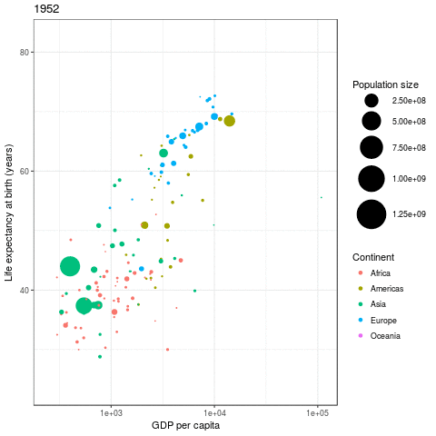

# Animations with `ggplot2`

There is also a dearth of add-on packages that build on `ggplot2`. A list of some of these can be found [here](https://www.ggplot2-exts.org/index.html). One such example is the `gganimate` package. This package is in development, and cannot be found on the repositories. The source code is up on GitHub however, and can be found at [https://github.com/dgrtwo/gganimate](https://github.com/dgrtwo/gganimate).

Let's use this package to produce the same animation we did [earlier](#animation).

Since this package cannot be installed from CRAN, we can instead install using the `install_github()` function in the `devtools` package.

> **Note**: this might require you to reinstall some other packages. For example, I had an issue with a package `cowplot` not existing for my version of R:
> 
> ```install.packages("cowplot")
> Installing package into ‘/home/tj/R/x86_64-pc-linux-gnu-library/3.2’
> (as ‘lib’ is unspecified)
> Warning in install.packages :
>   package ‘cowplot’ is not available (for R version 3.2.3)
> ```
> I solved this by finding an older version of the package on CRAN (by clicking on *Packages* then *Archived*):
> 
> I noted the version number, and then used a function from `devtools` called `install_version()` as follows:
> ```{r, eval = F}
> library(devtools)
> install_version("cowplot", version = "0.6.3", repos = "https://cran.r-project.org/")
> ```
  
  Let me know if you have any problems.

```{r, eval = F}
library(devtools)
install_github("dgrtwo/gganimate")
```

Once installed, we can load the package and then use the `gganimate()` function to produce the animation. An optional `file` argument can be used to specify the output file. R even figures out what type of animation you require from the file extension! The only thing we have to do is to add an extra `frame` aesthetic to the `ggplot()` call to tell `gganimate` how to produce the frames for the animation. (**Note** that we pass the plot object into a variable `p` and enter this into `gganimate()`. We could **nest** these functions, but this is much neater.)

```{r, results = "hide", message = F}
library(gganimate)

p <- ggplot(gapminder, 
       aes(x = gdpPercap, y = lifeExp, size = pop, colour = continent,
           frame = year)) +
    geom_point() + 
    scale_x_continuous(trans = "log10") +
    scale_size_area(max_size = 15) +
    xlab("GDP per capita") +
    ylab("Life expectancy at birth (years)") +
    guides(colour = guide_legend(title = "Continent")) +
    guides(size = guide_legend(title = "Population size")) +
    theme_bw()

gganimate(p, "gapminder_gg.gif")
```


