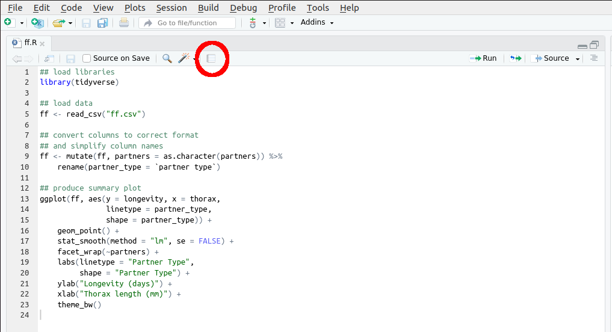
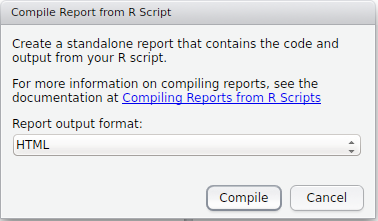
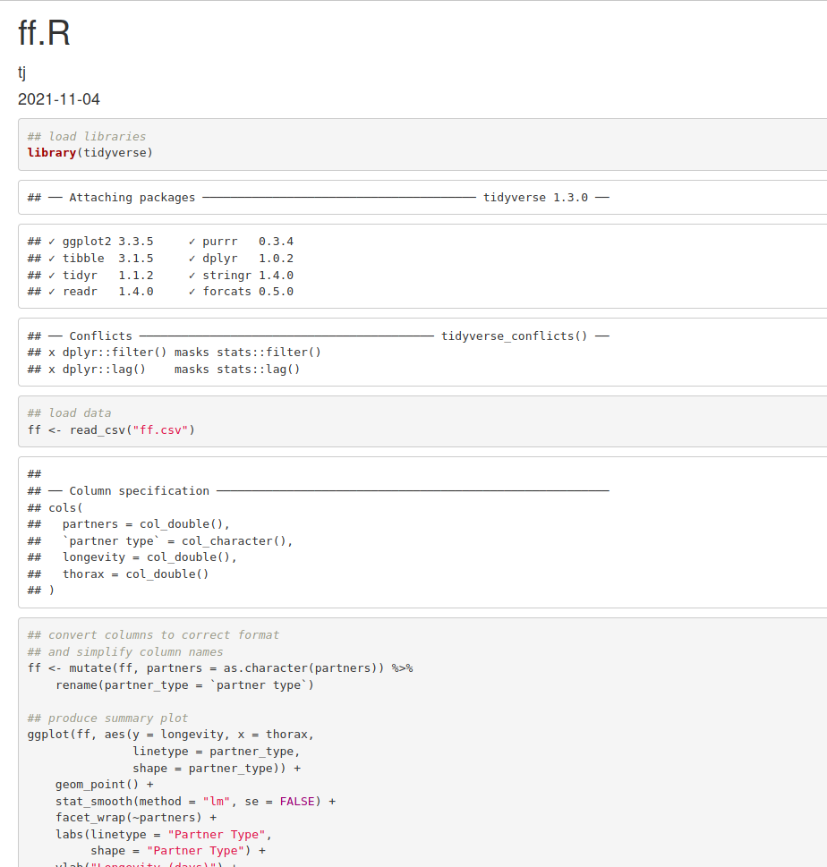

# Literate programming

Having a neat script file is the first step towards creating fully reproducible analyses. However, R offers more functionality than just the ability to write and comment scripts. There have been a series of key packages that have enabled R users to mix **input code** with **outputs** from the code, to produce fully reproducible **documents** (as opposed to *just* script files). This is otherwise known as [**literate programming**](https://cran.r-project.org/web/views/ReproducibleResearch.html).

The first major package was `sweave`, written by Friedrich Leisch, which allowed R code to be integrated into [LaTeX](https://www.latex-project.org/) documents. The `sweave` functionality has now been integrated into the fantastic [`knitr`](https://yihui.name/knitr/) package by [Yihui Xie](https://yihui.name/en/). `knitr` works with a variation of [Markdown](https://en.wikipedia.org/wiki/Markdown), and allows code snippets (or **chunks**) to be integrated into a document written in [Markdown](https://en.wikipedia.org/wiki/Markdown), meaning that the code chunks are run as part of the typesetting of the document. This enables R coders to integrate input code and outputs within the same document. This has the additional benefit that there is a one-to-one relationship between the inputs and outputs; thus alleviating "cut-and-paste" errors (within reason. There are ways to introduce errors, but in general it is more difficult).

## Markdown

Markdown is a lightweight mark-up language that was originally designed to allow users to write HTML documents without needing to know how to code in HTML. However, powerful converters such as [pandoc](http://pandoc.org/) have extended this so that documents written in Markdown can be converted into a variety of different outputs.

Markdown was created with the mandate that documents should be **easy to read**---in essence you trade flexibility in formatting for ease-of-coding and understanding. [LaTeX](https://www.latex-project.org/) for example, is a phenomenally powerful typesetting language, but has a steep learning curve. In contrast, R Markdown can be summarised on two sides of A4: through the [R Markdown Cheat Sheet](https://www.rstudio.com/wp-content/uploads/2016/03/rmarkdown-cheatsheet-2.0.pdf). 

There are various "flavours" of Markdown, for example [GitHub-flavoured Markdown](https://guides.github.com/features/mastering-markdown/) is used on GitHub to render code and equations. R uses a version called [R Markdown](http://rmarkdown.rstudio.com/), and the developers of RStudio have integrated this directly in the RStudio IDE as part of the [`rmarkdown`](https://cran.r-project.org/web/packages/rmarkdown/index.html) package. They even provide lots of functionality for writing and typesetting R Markdown documents.

R Markdown is not limited solely to simple reproducible reports. A great place to start would be to browse the R Markdown website at [http://rmarkdown.rstudio.com/](http://rmarkdown.rstudio.com/).

> **Note**: R is a fast developing language, and RStudio a fast developing piece of software. Be aware that sometimes packages change, and so code that works using older versions of a package might not work with later versions. This is usually uncommon, and is usually straightforward to sort out. Very occasionally packages become deprecated, or subsumed into other packages, and so you might have to update your code accordingly from time-to-time. (Another reason why [Git](https://git-scm.com/) is so useful!) 

## Notepads and reports

One option that RStudio allows is for the user to create a simple report directly from an R script. This functionality is called **Compile Report**, and can be triggered in my version of RStudio by the shortcut `Ctrl-Shift-K`. Firstly, download the R script file "worms.R" from the workshop website into your working directory, and then load it into RStudio. This is a copy of the script I wrote earlier, and should contain the code [here](#wormscript).

The **Compile Report** option can also be triggered by hitting the report button shown in Figure \@ref(fig:comprep) (note that if you have a different version of RStudio, this button might be in a different place).

```{r, comprep, fig.cap = "Compile Report button", echo = F, out.width = "80%", out.height = "80%"}

```

This then brings up a window asking what output format you would like to compile into Figure \@ref(fig:comprep1).

```{r, comprep1, fig.cap = "Compile Report window", echo = F, out.width = "50%", out.height = "50%"}

```

There are three main options:

1. **PDF**: this requires that LaTeX is installed on your system. There are various options, please see [here](https://www.latex-project.org/get/) for details. Once LaTeX is installed, RStudio should deal with all of the typesetting for you. On the university PCs you might not be able to install new software without administration rights, so we are going to stick with producing HTML documents here. Which leads me onto...
2. **HTML**: this should work out-of-the-box, and produces a standalone HTML page that can be viewed in a standard web browser. (RStudio also provides a lightweight browser to view these pages, which it usually loads automatically.)
3. **MS Word**: this should also work as long as a copy of Word is installed. 

Feel free to play aorund with these options, however for the purposes of this practical we shall compile everything into HTML for consistency. Hence choose the HTML option, and RStudio should open the compiled document in the **Viewer** pane, as shown in Figure \@ref(fig:report).

```{r, report, fig.cap = "HTML report", echo = F, out.width = "50%", out.height = "50%"}

```

```{task}
Take your script file you created in the last task for the fruitfly data, and compile it into a report.
```

Notice that we have yet to write *any* markdown yet at all; R has simply run each command in the script, and produced an output document that weaves the input code and the corresponding outputs. This is really useful to visualise and check your code, but is not particularly beautiful or informative to look at!
