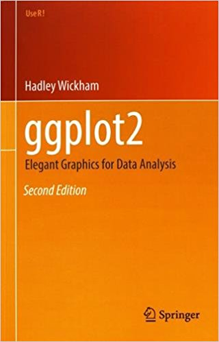
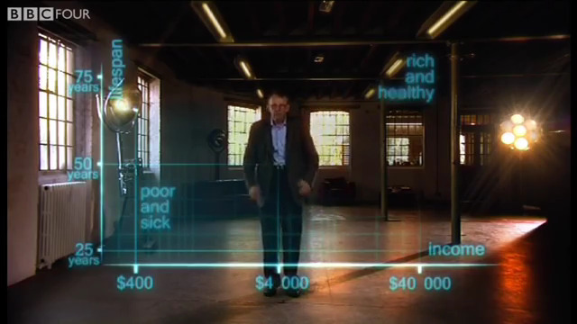

```{r, setup, child = "../setupFiles/_setup.Rmd", include = FALSE, purl = FALSE, cache = FALSE}
```

```{r, include = FALSE}
opts_chunk$set(echo = TRUE)
```

## 'Tidy' data

> "Tidy datasets are all alike but every messy dataset is messy in its own way."---[Hadley Wickham](http://hadley.nz/)

Specifically, a **tidy** data set is one in which:

* **rows** contain different **observations**;
* **columns** contain different **variables**`r footnotemark()`;
* **cells** contain values.

The idea of 'tidy' data gives rise to the nomenclature of the `tidyverse`.

```{footnotes}
but variables have to make sense, so having a `Sex` column with levels: `Male`, `Female`, `All` would not make sense because `Male` and `Female` are nested within `All`
```

## The `tidyverse`

The [`tidyverse`](https://www.tidyverse.org/) is a suite of R packages designed for **data science**. All packages share an underlying design philosophy and grammar. All exploit the power of 'tidy' datasets.

Rather than load each separate package, we will load them all`r footnotemark()` using:

```{r, message = FALSE, warning = FALSE}
library(tidyverse)
```

```{footnotes}
they can be installed using `install.packages("tidyverse")`, though this takes some time...
```

## The `tidyverse`

`tidyverse` packages include:

* tidyr
* ggplot2
* dplyr
* purrr
* readr
* tibble

We will use functionality from some of these packages in these workshops, though we will not distinguish which functions come from which packages (which is OK as long as you load the whole `tidyverse`).

## Cheat sheets

The architect of the `tidyverse` , [Hadley Wickham](http://hadley.nz/), is now Chief Scientist at RStudio, and so these packages are well supported and well-documented.

Cheat sheets can be found at:

`r benv("center")`

[https://www.rstudio.com/resources/cheatsheets/](https://www.rstudio.com/resources/cheatsheets/).

`r eenv("center")`

These are really useful resources!

## Further reading

`r benv("smaller")`

I would highly recommend:

`r br()`

`r bcols()`
`r bcol(0.48, TRUE)`

**R for Data Science**

`r br()`

```{r, out.width = "50%", echo = FALSE}
include_graphics("images/RforDS.png")
```

Link: [https://r4ds.had.co.nz/](https://r4ds.had.co.nz/)

`r ecol()`
`r bcol(0.48, TRUE)`

**ggplot2**

`r br()`

```{r, out.width = "48%", echo = FALSE}

```

Link: [https://ggplot2-book.org/](https://ggplot2-book.org/)

`r ecol()`
`r ecols()`

`r eenv("smaller")`

## What we're aiming for...

`r benv("center")`

```{r, out.width="70%", echo = FALSE}

```

Courtesy of the inimitable [Hans Rosling](https://en.wikipedia.org/wiki/Hans_Rosling). 

Link: [here](https://www.youtube.com/embed/jbkSRLYSojo)

`r eenv("center")`

## Remember

Don't forget to:

* download the datasets required from ELE or the link in the notes;
* set up your **working directory**;
* use **script files** to record what you've done!

## Example: Titanic survival data

Let's have a look at some data:

`r br()`
`r bcols()`
`r bcol(0.48)`
    
```{r, out.width = "90%", echo = FALSE}
include_graphics("images/titanic.jpg")
```

`r ecol()`
`r bcol(0.48)`

`r benv("smaller")`

On April 15, 1912, during her maiden voyage, the [Titanic](https://en.wikipedia.org/wiki/RMS_Titanic) sank after colliding with an iceberg, killing 1502 out of 2224 passengers and crew.

`r br()`

This tragedy shocked the international community and led to better safety regulations for ships.

`r eenv("smaller")`
    
`r ecol()`
`r ecols()`

## Example: Titanic survival data

We have a subset of the available data (excluding crew), and want to explore which characteristics of people meant they were more likely to survive?

```{r, message = FALSE, echo = FALSE}
## load data and look at top few rows
titanic <- read_csv("titanic.csv")
titanic <- titanic %>%
    mutate(name = abbreviate(name)) %>%
    mutate(pclass = as.character(pclass)) %>%
    mutate(survived = as.character(survived)) %>%
    as.data.frame()
head(titanic)
```

```{r, echo = FALSE, eval = FALSE}
saveRDS(titanic, "titanic.rds")
```

Are these data 'tidy'?

## Example: Titanic survival data

```{r, echo = FALSE}
head(titanic)
```

These data are tidy!

* **Rows** contain different **observations**;
* **columns** contain different **variables**;
* **cells** contain values.

## Untidy ('messy') data

What about the following data set?

```{r, echo = FALSE, message = FALSE, warning = FALSE}
temp <- tribble(~Replicate1, ~Replicate2, ~Replicate3,
                1.2, 2.2, 2.3,
                3.4, 3.5, 2.9)
temp <- as.data.frame(temp)
rownames(temp) <- c("TreatmentA", "TreatmentB")
temp
```

\uncover<2->{These data are \textbf{not} `tidy'.}

## Untidy ('messy') data

A 'tidy' version would be:

```{r, echo = FALSE, message = FALSE, warning = FALSE}
temp %>% rownames_to_column("Treatment") %>%
    gather(Replicate, Measurement, -Treatment)
```

`tidyverse` has a lot of useful package to help manipulate, join and tidy messy data sets, which are beyond the scope of today's workshop. Check out the [R For Data Science](https://r4ds.had.co.nz/) book as a good place to start.

## Introduction to `ggplot2`

For this workshop we will assume that we have a 'tidy' data set that we wish to visualise, and we will use the package `ggplot2``r footnotemark()` to produce beautiful plots of various different types from this data set.

`ggplot2` is a hugely powerful package, and is the *de facto* package of choice for many data scientists. We will see how this package makes complex plots easy!

```{footnotes}
loaded automatically as part of tidyverse
```

## Example: Titanic survival data

One of the principal motivations for statistical analyses is to quantify relationships (and differences) between variables in the face of uncertainty.

**Data visualisation** is a core component of good statistical modelling.

Let's start by drawing a **bar plot** describing the numbers of individuals that died on the Titanic.

## Example: Titanic survival data

For comparison let's look at standard base R, next to `ggplot2`:

`r bcols("t")`
`r bcol(0.48)`

```{r}
barplot(table(titanic$survived))
```

`r ecol()`
`r bcol(0.48)`

```{r}
ggplot(titanic) + 
    geom_bar(aes(x = survived))
```

`r ecol()`
`r ecols()`

## Example: Titanic survival data

So far, not so different. 

How about if we wanted to visualise something a bit more complex? 

For example, is the famous **"women and children first"** code-of-conduct supported by the Titanic survival data?

## Example: Titanic survival data

`r benv("smaller")`

Let's explore differences in survival between men and women first.

`r bcols("t")`
`r bcol(0.48)`

```{r}
barplot(table(titanic$gender, 
          titanic$survived))
```

`r ecol()`
`r bcol(0.48)`

```{r}
ggplot(titanic) + 
    geom_bar(aes(x = survived, 
                 fill = gender))
```

`r ecol()`
`r ecols()`

`r eenv("smaller")`

## Example: Titanic survival data

`r benv("smaller")`

Now let's add **passenger class** into the mix...

`r bcols("t")`
`r bcol(0.48)`

```{r, out.width = "90%"}
par(mfrow = c(1, 3))
for(i in unique(titanic$pclass)) {
    temp <- titanic[
        titanic$pclass == i, ]
    barplot(table(temp$gender, 
          temp$survived))
}
```

`r ecol()`
`r bcol(0.48)`

```{r, out.width = "90%"}
ggplot(titanic) + 
    geom_bar(aes(x = survived, 
                 fill = gender)) +
    facet_wrap(~pclass)
```

`r ecol()`
`r ecols()`

`r eenv("smaller")`

## Example: Titanic survival data

Notice several things with the **base R** script:

* Requires us to set up multiple plots;
* requires `for()` loop;
* requires subsetting (and use of `$` operator);
* axes on different scales;
* no legends!

## Example: Titanic survival data

Full **base R** solution:

```{r, Rageclass, eval = FALSE}
## extract stratified tables of counts
bars <- lapply(unique(titanic$pclass), function(x, data){
    data <- data[data$pclass == x, ]
    table(data$gender, data$survived)
}, data = titanic)
names(bars) <- unique(titanic$pclass)

## set up axes
yrange <- c(0, max(do.call("rbind", lapply(bars, function(x){
    apply(x, 2, sum)
}))))

## produce plots
par(mfrow = c(1, 3))
for(i in 1:length(bars)){
    ## plot
    barplot(bars[[i]], main = names(bars)[i], ylim = yrange, 
            legend = rownames(bars[[i]]), 
            args.legend = list(title = "sex"))
}
```

## Example: Titanic survival data

Full **base R** solution:

```{r, eval = TRUE, echo = FALSE, ref.label = "Rageclass", fig.width = 7, fig.height = 3.5, out.width = "80%"}
```

## Example: Titanic survival data

Compare this to the **`ggplot2`** version:

```{r, fig.width = 7, fig.height = 3.5, out.width = "80%"}
ggplot(titanic) + 
    geom_bar(aes(x = survived, fill = gender)) +
    facet_wrap(~pclass)
```

## `ggplot2`

The ethos of `ggplot2` is that plots can be broken down into different **features**, most notably:

* **data**;
* **aesthetic mapping**;
* **geometric object**;
* **scales**;
* **faceting**;
* statistical transformations;
* coordinate system;
* position adjustments.

## Data

Firstly, `ggplot2` ***always*** operates on `data.frame``r footnotemark()` objects. Hence we always set up a plot by telling the `ggplot()` function which data frame we are operating on e.g.

```{r, eval = FALSE, size = "larger"}
ggplot(titanic)
```

```{footnotes}
or `tibble` objects---which are special types of data frame that you might come across if you delve more into `tidyverse`
```

## Geoms

A **geom** defines the type of plot we want. In this case we want a **barplot**, which can be defined by the `geom_bar()` function. 

Geoms can be layered, allowing us to built complex plots in different ways. Common geoms are:

`r bcols()`
`r bcol(0.48)`

* `geom_point()`
* `geom_line()`
* `geom_histogram()`

`r ecol()` 
`r bcol(0.48)`

* `geom_density()`
* `geom_bar()`
* `geom_violin()`

`r ecol()`
`r ecols()`

Please see the [Data Visualisation Cheat Sheet](https://github.com/rstudio/cheatsheets/raw/master/data-visualization-2.1.pdf) for more examples.

## Aesthetics

**Aesthetics** define how the data are **mapped** onto the visual *aesthetics* of the plot. In general, **aesthetics** include:

* position;
* colour (border or line color);
* fill (inside color);
* shape;
* linetype;
* size.

The choice of aesthetic depends on the **`geom`**, and must be specified using the `aes()` function.

## Example: Titanic survival data

In our initial survival plot, we wanted a bar chart, with the $x$-axis relating to survival/death, and the $y$-axis relating to the number of individuals in each group. 

In this case the **geom** is `geom_bar()`, and the **aesthetic** is `x`, where `x` must be set to the correct column of the `data.frame`:

```{r, eval = FALSE, size = "larger"}
ggplot(titanic) + 
    geom_bar(aes(x = survived))
```

Here the `geom_bar()` function automatically produces the $y$-axis output as the *counts* in each category of the `x` variable.

## Building plots

`ggplot2` **builds** plots up by **adding** together components (using the `+` operator). 

If splitting the code over multiple lines, make sure the `+` sign is at the **end** of each line.

```{r, eval = FALSE, size = "larger"}
ggplot(titanic) +
    geom_bar(aes(x = survived))
```

## Building plots

To stratify by `gender` is easy. We simply set the corresponding **aesthetic**: in this case we can use the `fill` aesthetic to produce different bars for each level of the `fill` variable:

`r bcols()`
`r bcol(0.48)`

```{r, eval = FALSE}
ggplot(titanic) + 
    geom_bar(aes(x = survived, 
                 fill = gender)) 
```

`r ecol()`
`r bcol(0.48)`

```{r, echo = FALSE}
ggplot(titanic) + geom_bar(aes(x = survived, fill = gender))
```

`r ecol()`
`r ecols()`

## Building plots

Notice that we did not require any subsetting or `$` operators. 

The beauty of 'tidy' data is that `ggplot2` knows how to handle data of this form, and furthermore, knows where to look for the data (because we've told it to look in the `titanic` data frame).

```{r, eval = FALSE, size = "larger"}
ggplot(titanic) +
    geom_bar(aes(x = survived, fill = gender))
```

Notice also that it's added a legend automatically! Neat eh?

## Your turn

Now have a go at some of the exercises in Section 1.3 of the lecture notes. This uses the `iris` data set in R to illustrate some of these concepts, but this time generating a scatterplot.

To do this we will need a new geom (`geom_point()`) and new aesthetics (`y` and `colour`). Otherwise the approach is very similar to the bar plot example.

## Facets

One really neat feature of `ggplot2` is the ability to generate separate plots using **faceting**.

There are two flavours of facet:

* `facet_wrap()`;
* `facet_grid()`.

## Facets

We saw an example earlier where we wanted to further stratify our bar plot by **passenger class**.

This is coded as a column called `pclass` in the `titanic` data frame.

Because the data is 'tidy', we only have to add a single line to our code:

```{r, eval = FALSE, size = "larger"}
facet_wrap(~pclass)
```

This says to create different plots for each unique element of the `pclass` variable

## Facets

`r bcols()`
`r bcol(0.48)`

```{r, eval = FALSE}
ggplot(titanic) + 
    geom_bar(aes(x = survived, 
                 fill = gender)) +
    facet_wrap(~pclass)
```

`r ecol()`
`r bcol(0.48)`

```{r, echo = FALSE}
ggplot(titanic) + geom_bar(aes(x = survived, fill = gender)) +
    facet_wrap(~pclass)
```

`r ecol()`
`r ecols()`

## Facets

We may want to swap variables around, which is now straightforward:

`r bcols()`
`r bcol(0.48)`

```{r, eval = FALSE}
ggplot(titanic) + 
    geom_bar(aes(x = survived, 
                 fill = pclass)) +
    facet_wrap(~gender)
```

`r ecol()`
`r bcol(0.48)`

```{r, echo = FALSE}
ggplot(titanic) + geom_bar(aes(x = survived, fill = pclass)) +
    facet_wrap(~gender)
```

`r ecol()`
`r ecols()`

## Putting these ideas together

`facet_grid()` is used less often, but allows you to facet by more than one variable e.g.

`r bcols()`
`r bcol(0.48)`

```{r, eval = FALSE}
ggplot(titanic) + 
    geom_bar(aes(x = survived)) +
    facet_grid(pclass ~ gender)
```

`r ecol()`
`r bcol(0.48)`

```{r, echo = FALSE, warning = FALSE, message = FALSE}
ggplot(titanic) + 
    geom_bar(aes(x = survived)) +
    facet_grid(pclass ~ gender)
```

`r ecol()`
`r ecols()`

## Your turn

Have a go at Section 1.3.6 of the workshop.

## Statistical transformations

It is also possible to perform some useful statistical transformations of the data.

Common choices include `loess`/`gam` smoothing a scatterplot, or adding a *linear* line-of-best-fit.

These can be done simply in `ggplot2` using `stat_*()` functions.

## Example: Titanic survival data

Let's see whether there is any relationship between `age` and `fare`.

`r bcols()`
`r bcol(0.58)`

```{r, eval = FALSE}
ggplot(titanic) + 
    geom_point(aes(x = fare, y = age))
```

`r ecol()`
`r bcol(0.38)`

```{r, echo = FALSE, warning = FALSE, message = FALSE}
ggplot(titanic) + 
    geom_point(aes(x = fare, 
                 y = age))
```

`r ecol()`
`r ecols()`

## Example: Titanic survival data
\small
It may be easier to visualise if we add a smoothed line-of-best-fit (with **global** aesthetics):

`r bcols()`
`r bcol(0.58)`

```{r, eval = FALSE}
ggplot(titanic, aes(x = fare, y = age)) + 
    geom_point() +
    stat_smooth()
```

You can change the default parameters of the smoother, such as the bandwidth (see `?stat_smooth`).
`r br()`
Useful for exploratory purposes, but no substitute for a proper **model**!

`r ecol()`
`r bcol(0.38)`

```{r, echo = FALSE, warning = FALSE, message = FALSE}
ggplot(titanic, aes(x = fare, y = age)) + 
    geom_point() +
    stat_smooth()
```

`r ecol()`
`r ecols()`

## Example: Titanic survival data
\small
Not much going on here in my opinion. Note that `stat_*()` operations preserve aesthetics and facets. For example:

`r bcols()`
`r bcol(0.48)`

```{r, eval = FALSE}
ggplot(titanic, 
       aes(
           x = fare, 
           y = age, 
           colour = survived
       )
    ) + 
    geom_point() +
    facet_wrap(~gender) + 
    stat_smooth()
```

Notice smoother is heavily influenced by outliers here (producing large uncertainty bounds).

`r ecol()`
`r bcol(0.48)`

```{r, echo = FALSE, warning = FALSE, message = FALSE}
ggplot(titanic, aes(x = fare, y = age, colour = survived)) + 
    geom_point() +
    facet_wrap(~gender) + 
    stat_smooth()
```

`r ecol()`
`r ecols()`

## Your turn

Add some smoothed lines to your `iris` scatterplot. See Section 1.3.7 of the notes.

## Scales

**Scales** control the details of how data values are translated to visual properties. 

These allow us to control **translations** from data to aesthetics (e.g. change default colour schemes etc.). Scales are generally of the form `scale_AESTHETIC_*()` e.g.

`r bcols()`
`r bcol(0.58)`

```{r, eval = FALSE}
ggplot(titanic) + 
    geom_bar(
        aes(x = survived, fill = gender)
    ) +
    scale_fill_manual(
        values = c("red", "blue")
    )
```

`r ecol()`
`r bcol(0.38)`

```{r, echo = FALSE, warning = FALSE, message = FALSE}
ggplot(titanic) + 
    geom_bar(aes(x = survived, 
                    fill = gender)) +
    scale_fill_manual(values = c("red", "blue"))
```

`r ecol()`
`r ecols()`

## Positions

Some geoms offer alternative **positions**. For example, to change from a **stacked** bar plot to a **side-by-side** bar plot, we can set the `position` argument of `geom_bar()` to `"dodge"` e.g.

`r bcols()`
`r bcol(0.48)`

```{r, eval = FALSE}
ggplot(titanic) + 
    geom_bar(
        aes(
            x = survived, 
            fill = gender
        ),
        position = "dodge"
    )
```

`r ecol()`
`r bcol(0.48)`

```{r, echo = FALSE, warning = FALSE, message = FALSE}
ggplot(titanic) + 
    geom_bar(aes(x = survived, 
                    fill = gender),
             position = "dodge")
```

`r ecol()`
`r ecols()`

## Example: Gapminder

We will see some more examples of using **scales** and **positions**, plus ways to tidy up axis/legend labels etc., in the next example:

Now we will put all of these ideas together to produce a complex bubblechart of **life expectancy** against **log(GDP)**, of the form shown by Professor Rosling in his earlier talk.

Work through the tasks in Section 1.4 of the notes, and don't forget to ask if you don't understand anything.

## One more thing...
\small

One thing I haven't discussed is that it is possible to use different data sets for different geoms (analogous to **global** and **local** aesthetics).

For example, if you have a data set `SCATTER_DATA` (with columns: `XVAR` and `YVAR`), and a second data set containing predictions from a linear model say (called `PRED_DATA`, with columns: `XVAR`, `YPRED`, `YMIN` and `YMAX`), then you can write:

```{r, eval = FALSE}
ggplot() +
    geom_point(aes(x = XVAR, y = YVAR), data = SCATTER_DATA) +
    geom_line(aes(x = XVAR, y = YPRED), data = PRED_DATA) +
    geom_ribbon(aes(x = XVAR, ymin = YMIN, ymax = YMAX), 
                data = PRED_DATA, alpha = 0.5)
```

Here the `geom_point()` uses a different data set than the `geom_line()` and `geom_ribbon()` functions.

## Epilogue

To illustrate the importance of good data visualisation, I urge you to watch [Hans Rosling's](https://en.wikipedia.org/wiki/Hans_Rosling) TED talk: [The best stats you've ever seen](https://www.ted.com/talks/hans_rosling_shows_the_best_stats_you_ve_ever_seen?utm_source=tedcomshare&utm_medium=referral&utm_campaign=tedspread).

For me, he weaves a compelling narrative, which challenges our preconceptions about the world we live in, and does so without a statistical model or p-value in sight. Powerful stuff!

His book [Factfulness](https://www.gapminder.org/factfulness-book/), co-written with Ola Rosling and Anna Rosling R&ouml;nnlung, is also well worth a read!

## Epilogue

We have just begun to scratch the surface with what `ggplot2` can do (Section 1.7 will introduce ways to make animations and interactive plots using the `gganimate` and `plotly` packages).

I hope that this workshop has whetted your appetites to use this package in your work. I now use this for almost all of the plots I use in publications and teaching.

Please feel free to e-mail me with any further questions.

