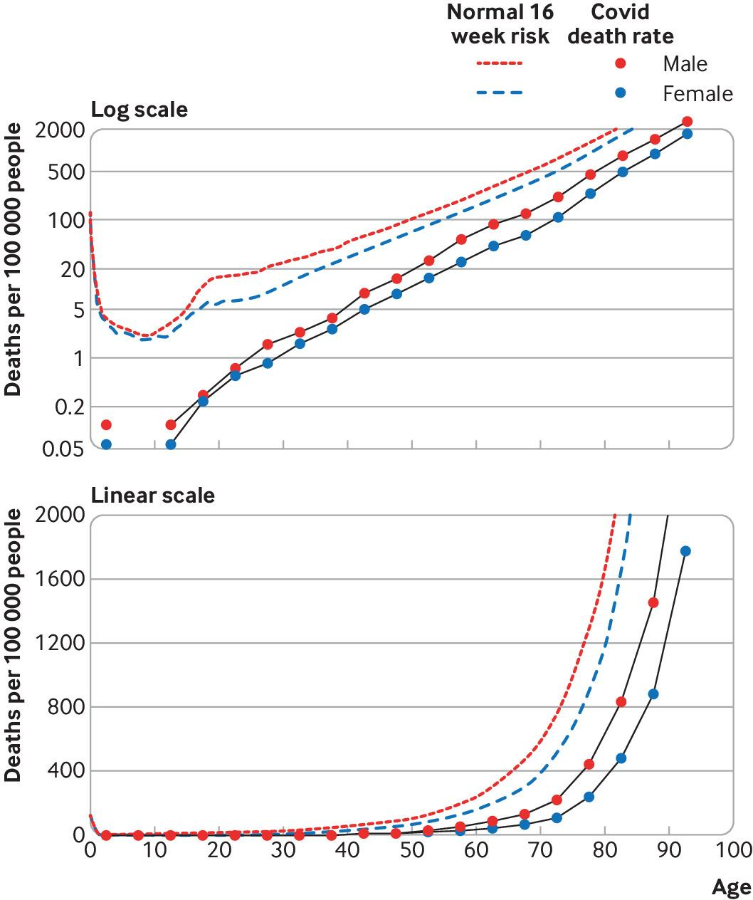
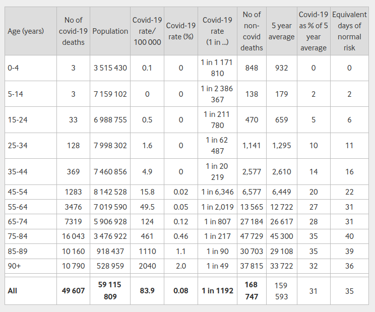

```{r, setup, child = "../setupFiles/_setup.Rmd", include = FALSE, purl = FALSE, cache = FALSE}
```

```{r, include = FALSE}
opts_chunk$set(echo = TRUE)
```

## COVID-19 in England and Wales

Here we will consolidate many of the ideas introduced in earlier lectures by re-creating some key figures from an influential early paper on mortality risk from COVID-19 infection, published by [Professor David Spiegelhalter](https://en.wikipedia.org/wiki/David_Spiegelhalter) in the BMJ.

```{r, echo = FALSE, out.width = "50%"}
include_graphics("images/davidS.png")
```

`r benv("smaller")`

[Spiegelhalter D. Use of "normal" risk to improve understanding of dangers of covid-19, *BMJ*, 2020; 370 :m3259](https://www.bmj.com/content/370/bmj.m3259).

`r eenv("smaller")`

## COVID-19 in England and Wales

`r benv("smaller")`

At the time this paper was published, there was great uncertainty about the mortality risks from COVID-19, and how these varied with age in particular. This paper compared the mortality risk from COVID-19 to the "normal" mortality risk, stratified by age and sex. A key figure is:

`r eenv("smaller")`

```{r, echo = FALSE, out.width = "40%"}

```

## COVID-19 in England and Wales

`r benv("smaller")`

This figure required **no statistical modelling**. It is purely a representation of the data that was available at the time, presented in a novel and informative way. The bulk of this practical will be to recreate this figure, using **publicly available data**.

`r eenv("smaller")`

```{r, echo = FALSE, out.width = "40%"}

```

## COVID-19 in England and Wales

Another key output from the paper is a table of mortality risks expressed in different ways, which we will also re-create:

```{r, echo = FALSE, out.width = "50%"}

```

The idea is to **consolidate** existing ideas, and introduce a few new useful things (such as the `patchwork` package) in the process.

## Other useful links

`r benv("center")`

```{r, echo = FALSE, out.width = "40%"}

```

[https://riskytalk.libsyn.com/](https://riskytalk.libsyn.com/)

[http://understandinguncertainty.org/](http://understandinguncertainty.org/)

`r eenv("center")`
