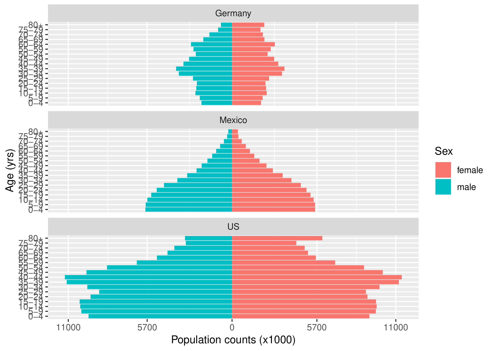

```{r, setup, child = "../setupFiles/_setup.Rmd", include = FALSE, purl = FALSE, cache = FALSE}
```

```{r, include = FALSE}
opts_chunk$set(echo = TRUE)
```

## Recap: 'Tidy' data

Specifically, a **tidy** data set is one in which:

* **rows** contain different **observations**;
* **columns** contain different **variables**`r footnotemark()`;
* **cells** contain values.

Remember:

> "Tidy datasets are all alike but every messy dataset is messy in its own way."---[Hadley Wickham](http://hadley.nz/)

```{footnotes}
but variables have to make sense, so having a `Sex` column with levels: `Male`, `Female`, `All` would not make sense because `Male` and `Female` are nested within `All`
```

## The `tidyverse`

In the previous session we explored the use of `ggplot2` to produce visualisations of complex data sets.

This utilised the fact that the data sets we had available were **'tidy'** (in the Wickham sense)!

However, it is estimated that data scientists spend around [50-80% of their time cleaning and manipulating data](https://www.nytimes.com/2014/08/18/technology/for-big-data-scientists-hurdle-to-insights-is-janitor-work.html?_r=0).

In this session we will explore the use of other `tidyverse` packages, such as `dplyr` and `tidyr`, that facilitate effective **data wrangling**.

## Cheat sheets

As before, useful cheat sheets can be found at:

`r benv("center")`

[https://www.rstudio.com/resources/cheatsheets/](https://www.rstudio.com/resources/cheatsheets/)

`r eenv("center")`

I would highly recommend downloading the appropriate ones (note that they do get updated from time-to-time as the packages are further developed).

## Further reading

`r benv("smaller")`

I would highly recommend Hadley Wickham and Garrett Grolemund's [**"R for Data Science"**](https://r4ds.had.co.nz/) book:

```{r, echo = FALSE, out.width = "20%"}
include_graphics("images/RforDS.png")
```

Can be bought as a hard copy, or a link to a free HTML version is [here](https://r4ds.had.co.nz/).

`r eenv("smaller")`

## What we're aiming for...

```{r, echo = FALSE, out.width = "80%"}

```

## Basic operations

We will assume here that we are working with `data.frame``r footnotemark()` objects`r footnotemark()`. 

Common data wrangling tasks include:

* sorting;
* **filtering**;
* **selecting** columns;
* transforming columns.

```{footnotes}
or `tibble` objects---see later
####
note that the `purrr` package provides functionality to wrangle different types of object, such as standard lists. We won't cover these here, but see Hadley's book, or the tutorials at [https://www.tidyverse.org/](https://www.tidyverse.org/) for more details
```

## Basic operations

These basic operators all have an associated function:

`r bcols("t")`
`r bcol(0.48)`

* sorting:
* **filtering**:
* **selecting** columns:
* transforming columns:

`r ecol()`
`r bcol(0.48)`

* `arrange()`;
* `filter()`;
* `select()`;
* `mutate()`.

`r ecol()`
`r ecols()`

However, each of these operations can be done in base R. So why bother to use these functions at all?

## Why bother?

`r benv("smaller")`

1. These functions are written in a **consistent** way: they all take a `data.frame`/`tibble` objects as their initial argument and return a revised `data.frame`/`tibble` object. 
2. Their names are informative. In fact they are **verbs**, corresponding to us **doing something specific** to our data. This makes the code much more readable, as we will see subsequently.
3. They do not require extraneous operators: such as `$` operators to extract columns, or quotations around column names.
4. Functions adhering to these criteria can be developed and expanded to perform all sorts of other operations, such as summarising data over groups.
5. They can be used in **pipes** (see later).

`r eenv("smaller")`

## Aside: `tibble` objects

`tidyverse` introduces a new object known as a `tibble`. Paraphrased from the `tibble` webpage:

`r br()`

> A `tibble` is an opinionated `data.frame`; keeping the bits that are effective, and throwing out what is not. Tibbles are **lazy** and **surly**: they do less (i.e. they don’t change variable names or types, and don’t do partial matching) and complain more (e.g. when a variable does not exist). **This forces you to confront problems earlier, typically leading to cleaner, more expressive code**`r footnotemark()`.

```{footnotes}
`tibble` objects also have an enhanced `print()` method
```

## Aside: `tibble` objects

`r benv("smaller")`

The `readr` package (part of `tidyverse`) introduces a `read_csv()``r footnotemark()` function to read `.csv` files in  as `tibble` objects e.g.

```{r, eval = FALSE}
gapminder <- read_csv("gapminder.csv")
gapminder
```

```{r, size = "smaller", echo = FALSE, message = FALSE, warning = FALSE}
library(tidyverse)
gapminder <- read_csv("gapminder/gapminder.csv")
gapminder
```

`r eenv("smaller")`

```{footnotes}
note the underscore (`read_csv`) **not** `read.csv()` as used in base R
```

## Aside: `tibble` objects

`r benv("smaller")`

**Notice**:

* `read_csv()` does not convert `characters` into `factors` automatically`r footnotemark()`;
* the `print()` method includes information about the type of each variable (e.g. `integer`, `logical`, `character` etc.), as well as information on the number of rows and columns.
* Furthermore, `tibble` objects allow for spaces in column names and allow column names to start with any character`r footnotemark()`.

There is also an `as_tibble()` function that will convert standard `data.frame` objects into `tibble` objects if required. In almost all of the `tidyverse` functions, you can use `data.frame` or `tibble` objects interchangeably.

```{footnotes}
although neither does `read.csv()` anymore, but only from R 4.0.0
####
although it is often a good idea to simplify complex names in practice
```

`r eenv("smaller")`

## Example: Superheroes

These data have been extracted from some data scraped by [FiveThirtyEight](https://fivethirtyeight.com/), and available [here](https://github.com/fivethirtyeight/data/tree/master/comic-characters).

We will assume the complete data consist of three tables:

* `comics`: a table of characters and characteristics;
* `publisher`: a table of characters and who publishes them ([Marvel](https://www.marvel.com/) or [DC](https://www.dccomics.com/));
* `year_published`: characters against the year they were first published.

## Example: Superheroes

Let's have a look at the `comics` data frame:

```{r, echo = -1, message = FALSE, warning = FALSE}
comics <- readRDS("comics/comics.rds")
comics
```

## Example: Superheroes

To extract a subset of these data, we can use the `filter()` function e.g.

```{r}
filter(comics, HAIR == "Black Hair")
```

## Example: Superheroes

We can also filter by multiple variables and with negation e.g.

```{r}
filter(comics, HAIR == "Black Hair" & EYE != "Blue Eyes")
```

## Example: Superheroes

To sort these data, we can use the `arrange()` function e.g.

```{r}
arrange(comics, APPEARANCES)
```

## Example: Superheroes

We can pass a column to the `desc()` function to sort in descending order, and can sort by multiple variables e.g.

```{r}
arrange(comics, HAIR, desc(APPEARANCES))
```

## Example: Superheroes

To extract a subset of ***columns*** of these data, we can use the `select()` function e.g.

```{r}
select(comics, name, HAIR, APPEARANCES)
```

## Example: Superheroes

A `!` prefix *removes* a column`r footnotemark()` e.g.

```{r}
select(comics, !APPEARANCES)
```

```{footnotes}
to remove multiple columns, use a concatenate operator e.g. `!c(col1, col2)`
```

## Example: Superheroes

To *transform* or *add* columns, we can use the `mutate()` function`r footnotemark()` e.g.

```{r}
mutate(comics, logApp = log(APPEARANCES))
```

```{footnotes}
see also `?transmute`
```

## Pipes

One of the most useful`r footnotemark()` features of `tidyverse` is the ability to use **pipes**.

Piping comes from Unix scripting, and simply allows you to run a chain of commands, such that the results from each command feed into the next one. 

`tidyverse` does this using the `%>%` operator`r footnotemark()`.

```{footnotes}
in my opinion
####
note that the fantastic [`magrittr`](https://cran.r-project.org/web/packages/magrittr/vignettes/magrittr.html) package that `tidyverse` uses does this more generally in R
```

## Pipes

`r benv("smaller")`

The pipe operator in R works by passing the **result** of the *left-hand side* function into the **first** argument of the *right-hand side* function.

Since all the functions we've seen so far take a `data.frame` as their first argument, and return a `data.frame`, then we can chain these together e.g.

```{r, eval = FALSE}
comics %>%
    select(name, APPEARANCES) %>%
    arrange(desc(APPEARANCES)) %>%
    mutate(logApp = log(APPEARANCES))
```

`r eenv("smaller")`

## Pipes

`r benv("smaller")`

`r bcols()`
`r bcol(0.58)`

```{r}
comics %>%
    select(name, APPEARANCES) %>%
    arrange(desc(APPEARANCES)) %>%
    mutate(logApp = log(APPEARANCES))
```

`r ecol()`
`r bcol(0.38)`

**Notice**:

* No need for *temporary* variables;
* less verbose;
* can be read like prose (easier to understand)

`r ecol()`
`r ecols()`

**Note**: if splitting over multiple lines, the pipe operator must be at the end of the previous line.

`r eenv("smaller")`

## Your turn

Have a read through Sections 6.1 and 6.2 of the notes, and have a go at the tasks.

## Aside: `across()`

There is a useful shortcut function: `across()`, that enables you to apply a transformation or summary to multiple columns without having to type everything out in long-hand.

As a simple example, let's summarise the data:

```{r, eval = FALSE}
summary(comics)
```

```{r, size = "smaller", echo = FALSE}
summary(comics)
```

Here the `character` columns do not provide a helpful summary. We could temporarily convert each `character` column to a `factor` to produce a better summary.

## Aside: `across()`

Instead let's try:

```{r, eval = FALSE}
comics %>% 
    mutate(across(where(is.character), as.factor)) %>%
    summary()
```

```{r, size = "smaller", echo = FALSE}
comics %>% 
    mutate(across(where(is.character), as.factor)) %>%
    summary()
```

Here the `where(is.character)` is a selection helper function that returns columns where `is.character()` is `TRUE`, and `across()` then operates across these columns to apply the function `as.factor()`. This leaves all columns that are not `character` types alone. This is much neater, and doesn't change the original data frame. See `vignette("colwise")` for more details.

## Grouping and summarising

`r benv("smaller")`

We may also want to produce summaries for different **subsets** of the data. 

For example, let's say we want to produce a mean number of appearances for superheroes with different eye colours`r footnotemark()`. We do this using the `group_by()` and `summarise()` functions e.g.

`r bcols()`
`r bcol(0.48)`

```{r, results = 'hold', eval = FALSE}
comics %>% 
    group_by(EYE) %>%
    summarise(
        meanApp = mean(APPEARANCES),
        .groups = "drop")
```

`r ecol()`
`r bcol(0.48)`

```{r, results = 'hold', echo = FALSE}
comics %>% 
    group_by(EYE) %>%
    summarise(
        meanApp = mean(APPEARANCES),
        .groups = "drop") %>%
    as.data.frame()
```

`r ecol()`
`r ecols()`

```{footnotes}
not very interesting I know...
```

`r eenv("smaller")`

## Grouping and summarising

`r benv("smaller")`

A particularly useful function is `count()`, which tabulates the numbers of observations. This is particularly useful when combined with `group_by()` e.g.

`r bcols()`
`r bcol(0.48)`

```{r, results = 'hold', eval = FALSE}
comics %>% 
    group_by(EYE) %>%
    count()
```

`r ecol()`
`r bcol(0.48)`

```{r, results = 'hold', echo = FALSE}
comics %>% 
    group_by(EYE) %>%
    count() %>%
    as.data.frame()
```

`r ecol()`
`r ecols()`
`r eenv("smaller")`

## Your turn

Have a crack at Section 6.3 of the lecture notes.

## `pivot_*()` functions

Other really important functions are `pivot_longer()` and `pivot_wider()`.

These functions are used to **manipulate** `data.frame` objects into different forms.

They are often key to wrangling 'messy' data sets into 'tidy' data sets.

## Example: Senate predictions 2018

Let's look at an example from the [FiveThirtyEight](https://projects.fivethirtyeight.com/2018-midterm-election-forecast/senate/?ex_cid=rrpromo) website.

These data show the predicted probability of each party winning each seat, based on a statistical model fitted on 30th October 2018.

I have filtered and wrangled these data to illustrate these methods, the original data were in fact 'tidy'!

## Example: Senate predictions 2018

Let's have a look at the data.

`r bcols()`
`r bcol(0.58)`

```{r, echo = -c(1, 2)}
## load data
senate <- readRDS("senate/senate.rds")
head(senate)
```

`r ecol()`
`r bcol(0.38)`

**Key**:

* **D**: Democrat
* **O**: Other
* **R**: Republican

`r ecol()`
`r ecols()`

These are **not** in 'tidy' format!

## `pivot_longer()`

To coerce these into 'tidy' format we can use the `pivot_longer()` function, which takes multiple columns, and gathers them into key-value pairs.

It takes the form:

```{r, eval = FALSE}
pivot_longer(data, cols, names_to, ..., values_to, ...)
```

Here `cols` relates to the columns that we wish to gather the names of which go into a new `names_to` column, and the values of which go into a new `values_to` column.

This is best illustrated by an example.

## Example: Senate predictions 2018
\small

`r bcols()`
`r bcol(0.45)`

```{r, echo = FALSE}
as.data.frame(senate[1, ])
```

`r ecol()`
`r bcol(0.55)`

Here we want to collapse the columns labelled `D`, `O` and `R` into a new column called `party` (the **key**), with the predicted proportions in a column called `prop` (the **value**). We do not want `state` to be gathered.

`r ecol()`
`r ecols()`

```{r, eval = FALSE}
senate %>%
    pivot_longer(!state, names_to = "party", values_to = "prop")
```

```{r, echo = FALSE}
senate %>%
    pivot_longer(!state, names_to = "party", values_to = "prop") %>%
    as.data.frame() %>%
    head()
```

## Example: Senate predictions 2018

Note that the following are **equivalent**:

`r bcols()`
`r bcol(0.48)`

```{r, eval = FALSE}
senate %>%
    pivot_longer(!state, 
        names_to = "party", 
        values_to = "prop")
```

`r ecol()`
`r bcol(0.48)`

```{r, eval = FALSE}
senate %>%
    pivot_longer(c(D, O, R), 
        names_to = "party", 
        values_to = "prop")
```

`r ecol()`
`r ecols()`

You can also pipe together to remove the extraneous `NA`s (and overwrite the original `senate` object)`r footnotemark()`:

`r bcols()`
`r bcol(0.48)`

```{r, results = "hide"}
senate <- senate %>%
    pivot_longer(c(D, O, R), 
        names_to = "party", 
        values_to = "prop") %>%
    filter(!is.na(prop))
```

`r ecol()`
`r bcol(0.48)`

```{r, echo = FALSE}
senate %>%
    as.data.frame() %>%
    head()
```

`r ecol()`
`r ecols()`

`r if(!is_html_output()) br()`

```{footnotes}
there are also ways in which this can be done directly in `pivot_longer()`, see `vignette("pivot")`.
```

## `pivot_wider()`

`r benv("smaller")`

`pivot_wider()` does the opposite of `pivot_longer()`: it takes two columns (`key` and `value`) and spreads these into multiple columns e.g.

`r bcols()`
`r bcol(0.48)`

```{r, eval = FALSE}
senate
```

```{r, echo = FALSE}
senate %>%
    as.data.frame() %>% head()
```

`r ecol()`
`r bcol(0.48)`

```{r, eval = FALSE}
senate %>%
    pivot_wider(names_from = party, 
        values_from = prop)
```

```{r, echo = FALSE}
senate %>%
    pivot_wider(names_from = party, values_from = prop) %>%
    as.data.frame() %>%
    head()
```

`r ecol()`
`r ecols()`
`r eenv("smaller")`

## Example: Senate predictions 2018

We can now do some more complex analyses. For example, to produce a table of binary predictions based on the highest probability of winning in each state (using the 'tidy' version of the data):

```{r, eval = FALSE}
senate %>%
    group_by(state) %>%
    mutate(outcome = ifelse(prop == max(prop), 1, 0)) %>%
    filter(outcome == 1) %>%
    group_by(party) %>%
    count() %>%
    pivot_wider(names_from = party, values_from = n)
```  

```{r, echo = FALSE}
senate %>%
    group_by(state) %>%
    mutate(outcome = ifelse(prop == max(prop), 1, 0)) %>%
    filter(outcome == 1) %>%
    group_by(party) %>%
    count() %>%
    pivot_wider(names_from = party, values_from = n) %>%
    as.data.frame()
```

## Unite and separate

Other useful functions are `unite()` and `separate()`, the former takes multiple columns and binds them together, and the latter takes a single column and splits it apart. For example:

`r bcols()`
`r bcol(0.48)`

```{r, results = "hide", size = "smaller"}
senate <- senate %>%
    group_by(state) %>%
    mutate(outcome = 
      ifelse(prop == max(prop), 1, 0)) %>%
    group_by(party, outcome) %>%
    count()
senate
```

```{r, echo = FALSE}
senate %>%
    as.data.frame() %>%
    head()
```

`r ecol()`
`r bcol(0.48)`

```{r, results = "hide", size = "smaller"}
senate <- senate %>%
    unite(outcome, 
          party, outcome, sep = "_")
senate
```

```{r, echo = FALSE}
senate %>%
    as.data.frame() %>%
    head()
```

`r ecol()`
`r ecols()`

## Unite and separate

To reverse this, we can use `separate()`:

`r bcols()`
`r bcol(0.38)`

```{r, results = "hide"}
senate
```

```{r, echo = FALSE}
senate %>%
    as.data.frame() %>%
    head()
```

`r ecol()`
`r bcol(0.58)`

```{r, results = "hide"}
senate <- senate %>%
    separate(outcome, 
      c("party", "outcome"), sep = "_")
senate
```

```{r, echo = FALSE}
senate %>%
    as.data.frame() %>%
    head()
```

`r ecol()`
`r ecols()`

## Your turn

Have a crack at Section 6.4 of the lecture notes.

## Joins

`r benv("smaller")`

A key data analytics skill is to be able to **join**  different tables together. This can be done using `*_join()` functions`r footnotemark()`. Key types of join are:

* `inner_join()`
* `left_join()` / `right_join()`
* `full_join()`
* `semi_join()` / `anti_join()`

You can join tables by **cross-referencing** against **key variables**. As an example, let's join two tables relating to information on superheroes...

```{footnotes}
these types of operations are also key to using databases, such as SQL and Access. In fact, `tidyverse` has a range of packages that can interact with e.g. SQL databases directly and perform a range of operations, converting R code into the required SQL code, running the operation (query), and pulling the results back to R
```

`r eenv("smaller")`

## Joins

```{r}
comics
```

`r bcols()` 
`r bcol(0.48)`

```{r, eval = FALSE}
year_published
```

```{r, echo = FALSE}
year_published <- readRDS("comics/year_published.rds")
year_published
```

`r ecol()`
`r bcol(0.48)`

Here we will join the two tables by **`name`**.

`r ecol()`
`r ecols()`

## `inner_join()`

The simplest type of join is an **inner join**. This joins two data frames and *retains only those rows in each data frame that can be matched* e.g.

```{r}
inner_join(comics, year_published, by = "name")
```

## `left_join()`

A **left join** retains *all rows* in the **left** data frame, but *only* rows in the **right** data frame that *can be matched* e.g.

```{r}
left_join(comics, year_published, by = "name")
```

Here R replaces elements it can't match with `NA`.

## `right_join()`

A **right join** retains *all rows* in the **right** data frame, but *only* rows in the **left** data frame that *can be matched* e.g.

```{r}
right_join(comics, year_published, by = "name")
```

This is the same as the `inner_join()` in this case. Why?

## `full_join()`

A **full join** retains *all rows* in the **both** data frames e.g.

```{r}
full_join(comics, year_published, by = "name")
```

This is the same as the `left_join()` in this case. Why?

## `semi_join()`

A **semi join** return *all rows* from the **left** data frame where there *are matching* values in the **right** data frame. It returns just columns in the **left** data frame, and does not duplicate rows (i.e. it is a *filtering* join):

```{r}
semi_join(comics, year_published, by = "name")
```

## `anti_join()`

An **anti join** return *all rows* from the **left** data frame where there *are* ***not*** *matching* values in the **right** data frame. It returns just columns in the **left** data frame, and does not duplicate rows (i.e. it is a *filtering* join):

```{r}
anti_join(comics, year_published, by = "name")
```

## Joins

`r benv("smaller")`

We can also join multiple tables together using e.g. **pipes** (or similar)

```{r}
comics
```

`r bcols("t")` 
`r bcol(0.48)`

```{r, eval = FALSE}
year_published
```

```{r, echo = FALSE}
year_published
```

`r ecol()`
`r bcol(0.48)`

```{r, eval = FALSE}
publisher
```

```{r, echo = FALSE}
publisher <- readRDS("comics/publisher.rds")
publisher
```

`r ecol()`
`r ecols()`
`r eenv("smaller")`

## Joins

```{r}
comics %>%
    full_join(year_published, by = "name") %>%
    full_join(publisher, by = "name")
```

## Joins

**Note**: you can also join by more than one variable e.g.

```{r, eval = FALSE}
inner_join(x, y, by = c("variable1", "variable2"))
```

## Your turn

Have a crack at Section 6.5 of the lecture notes.

## Epilogue

You should now be ready to work through the final (more comprehensive) example in Section 6.6 of the lecture notes.

This brings together various aspects of the last two chapters. We take multiple 'messy' data sets, join them together, wrangle them into the correct format and then plot them using `ggplot2`.

Along the way we use a few features of `tidyverse` that we haven't introduced, so I wouldn't expect you to be able to recreate this plot from scratch, but I want you to go through the code and understand what is happening.

## Epilogue

Hopefully these few weeks have given you a flavour of the power of `tidyverse`.

I, for one, do most of my data analyses using `tidyverse` now, although remember that it may not be suitable for all types of data / analysis method, so you should view these packages as a series of tools in your data science arsenal.

If this has whetted your appetite, I can thoroughly recommend Hadley Wickham and Garrett Grolemund's [**"R for Data Science"**](https://r4ds.had.co.nz/) book!

Please feel free to e-mail me if you have any further questions.


