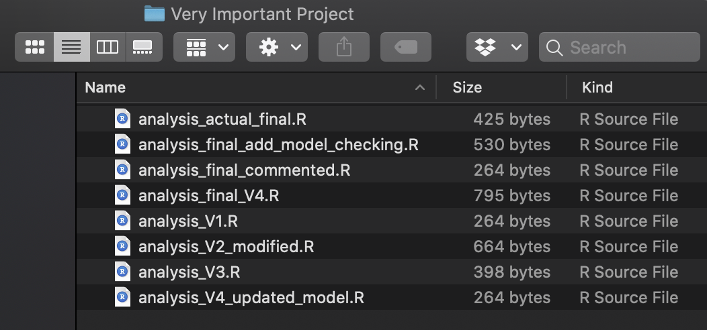

```{r, setup, child = "../setupFiles/_setup.Rmd", include = FALSE, purl = FALSE, cache = FALSE}
```

```{r, include = FALSE}
opts_chunk$set(echo = TRUE)
```

## Life before version control

```{r version-disaster, echo = FALSE, out.width="70%"}

```

Things get out of control pretty quickly...

## Life before version control

```{r, echo = FALSE, out.width="40%"}
knitr::include_graphics("images/final_doc.png")
```

Reproduced from [PhD Comics](http://phdcomics.com/comics/archive.php?comicid=1531)

## Version control systems

Version control systems are software that **track changes** done to a set of files over time in a systematic fashion, such that previous versions can be easily accessed and compared. 

Effectively, we start with a **base** version of the file and then record any changes done along the way---leaving a **fossil record** that captures the evolution of the source code.

## Version control systems

Having this **fossil history** has several advantages:

* Your code isn't working as it used to. Go back to the last working version, then carefully add and step through the new additions.
* You want to experiment without worrying about breaking the rest of your code.
* You deleted some code that in hindsight was useful and you want it back.
* Effective and transparent collaboration among a group of people.
* Access to an auditable project history. You know exactly when / what / why you did something.

## Git

`r bcols()`
`r bcol(0.48)`

[Git](https://git-scm.com/) is the most popular version control system currently in use.

It was created by [Linus Torvalds](https://en.wikipedia.org/wiki/Linus_Torvalds), creator of the [Linux](https://en.wikipedia.org/wiki/Linux_kernel) kernel.

It is **free** and **open-source**.

`r br()`

```{r, echo = FALSE, out.width = "50%"}
knitr::include_graphics("images/git.png")
```

`r ecol()`
`r bcol(0.48)`

`r benv("center")`

```{r, echo = FALSE, out.width = "50%"}

```

Courtesy of [Wikipedia](https://commons.wikimedia.org/wiki/File:Lc3_2018_(263682303)_(cropped).jpeg)

`r eenv("center")`

`r ecol()`
`r ecols()`

## Git

We will use Git on the **command line**, through a **Terminal** on Linux/Mac, and through **Git Bash** on Windows.

Git command are structured as`r footnotemark()`:

```
$ git verb options
```

```{footnotes}
The `$` is just to remind us that we type these commands into a **command prompt**
```

## Setup

To set up Git, first set your credentials. 

```
$ git config --global user.name "Jon Snow"
$ git config --global user.email "jon.snow@nightwatch.com"
```

These should only need to be set up once on each machine, and will apply to all Git repositories interacted with on your machine.

## Initialising a repo

A **Git repository** can be initiated in any folder`r footnotemark()`, and will then track changes in any sub-folders.

To initialise a Git repository, you can migrate to the directory in bash, and then simply type

```
$ git init
```

```{footnotes}
you can use the command `$ cd path/to/repo`
```

## Main commands

```
$ git init        # create an empty Git repository
$ git status      # view the current state of the repository
$ git add         # add files to the staging area (prepare for commit)
$ git commit      # record changes to the repository
$ git log         # show the commit history
$ git checkout    # switch to a specific commit or branch
$ git diff        # view changes across different commits
$ git branch      # create / delete branch
```


