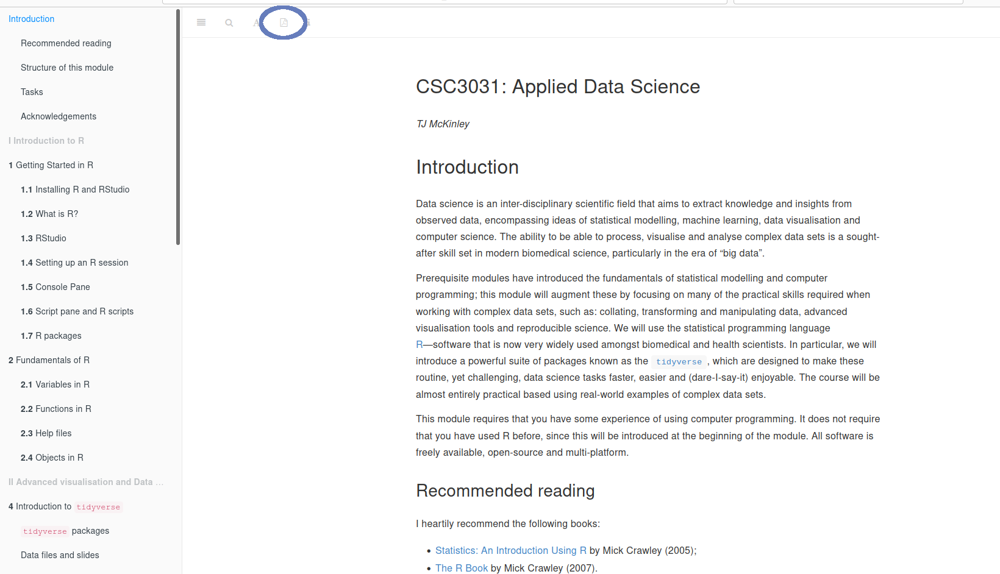
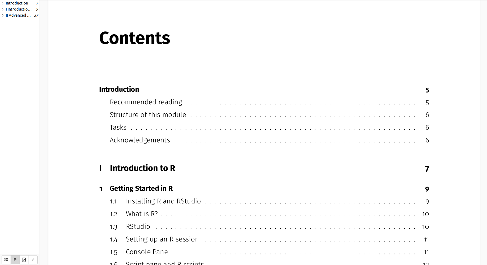
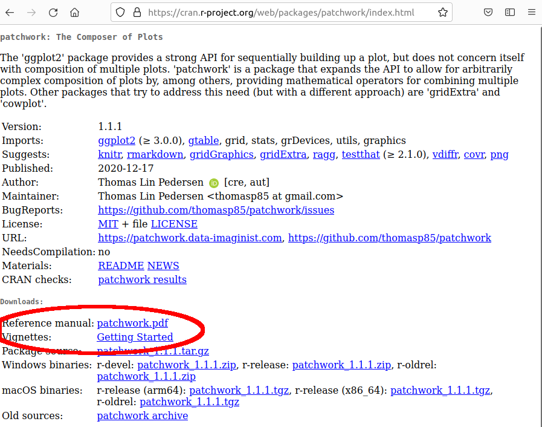
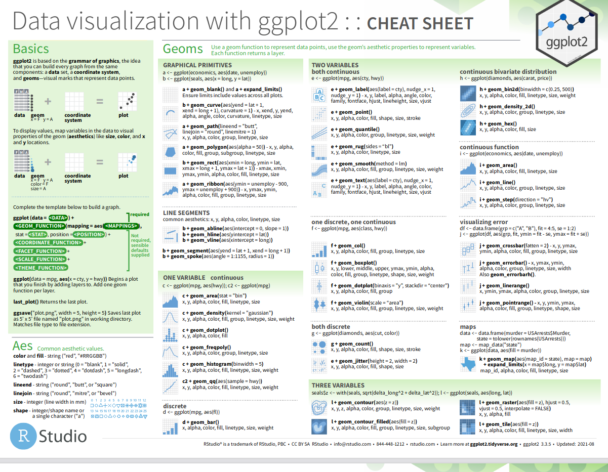
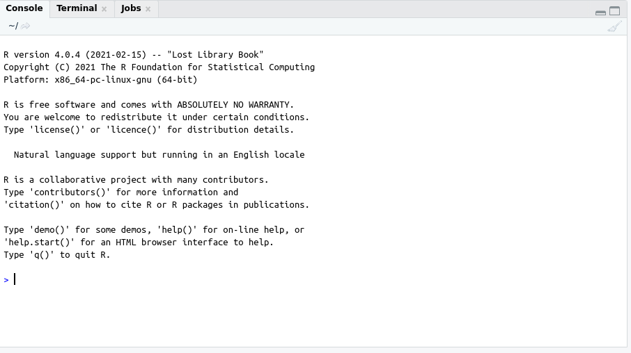
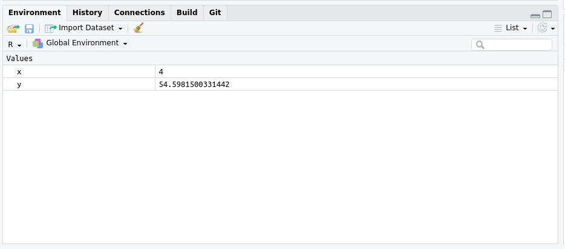
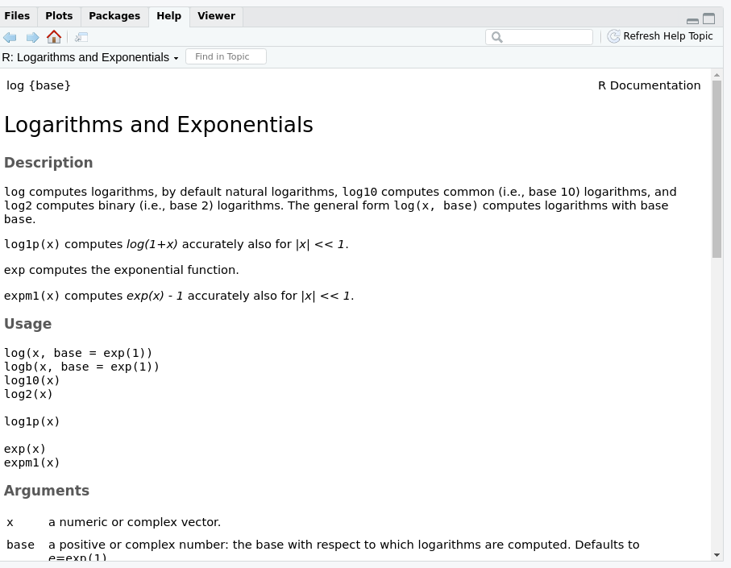

```{r, setup, child = "../setupFiles/_setup.Rmd", include = FALSE, purl = FALSE, cache = FALSE}
```

```{r, include = FALSE}
opts_chunk$set(echo = TRUE)
```

## What is R?

`r benv("smaller")`

[R](https://cran.r-project.org/) is an **open-source**, **multi-platform** and **freely available** statistical programming language.

R:

* is a flexible **programming** language;
* has powerful **statistical analysis** tools;
* has amazing graphical and data processing capabilities; 
* can use scripts and be run in batch mode; 
* can integrate with other languages, such as C and Python; 
* can be used to produce **reproducible** documents, presentations and interactive webpages. 

Did I mention that R is completely **free** and **open-source**...?

`r eenv("smaller")`

## Structure of the module

Full lecture notes will be available on ELE in both HTML and PDF formats:

`r bcols()`
`r bcol(0.48)`

```{r, echo = FALSE}

```

`r ecol()`
`r bcol(0.48)`

```{r, echo = FALSE}

```

`r ecol()`
`r ecols()`

## Structure of the module

We have 3 hours per week in the computer labs, and each week we will work through one of the chapters. I will talk through some slides at various points during the session to give you guidance. You will be expected to work through each session in full, outside of the practical session as required.

```{box, wrap = TRUE}
An ELE forum / Teams group will be provided for you to ask questions.
```

There are tasks to complete during each workshop, which act as formative questions to help you consolidate these ideas as we go through the module. Full solutions are provided.

## Summative assessments

There will be one piece of coursework, in the form of a programming report. This will be worth 50% of the total module mark.

There will also be a 2.5hr (open-book) practical exam worth 50% of the module mark (**Option 4 exam**).

## RStudio

R can be run on the command line, or has its own native GUI on Windows. However, we will use a multi-platform IDE called [RStudio](https://www.rstudio.com/).

```{r, echo = FALSE, out.width = "70%"}
include_graphics("images/rstudio.png")
```

## Packages

`r benv("smaller")`

R has a large user-base, resulting in many **add-on packages**, providing a huge variety of functions and methods to facilitate a huge variety of statistical, analysis and programming tasks.

There are two main repositories:

* [CRAN](https://cran.r-project.org/)`r footnotemark()`---hosting $>18,000$ packages as of September 2021.
* [Bioconductor](https://www.bioconductor.org/)---predominantly **bioinformatics** packages, with $>2,000$ packages as of September 2021.

All the packages we will use are available from CRAN, and can be installed directly from R. 

**Source code** and **development** packages are often hosted on sites such as [GitHub](https://github.com/), and can be installed from source with the correct tools.

```{footnotes}
Comprehensive R Archive Network
```

`r eenv("smaller")`

## Packages

`r benv("smaller")`

All packages hosted on CRAN must provide documentation in the form of **help files**. Some package developers also develop **vignettes**`r footnotemark()`.

```{r, echo = FALSE, out.width = "50%"}

```

```{footnotes}
these are **long-form** documentation describing how the package works and how to use it
```

`r eenv("smaller")`

## Cheatsheets

More recently have been pioneered (in particular) for packages developed by RStudio, and a bunch of useful cheat sheets for various packages can be found at e.g. [https://www.rstudio.com/resources/cheatsheets/](https://www.rstudio.com/resources/cheatsheets/).

```{r, echo = FALSE, out.width = "50%"}

```

## Console window

R is an **interpreted** language, so you can enter commands into the **command prompt** (`>`) in the **console** window, and R will run the command and generate output.

```{r, echo = FALSE, out.width = "70%"}

```

## Console window

For example:

```{r}
2 + 2
```

```{r}
exp(5)
```

## Variables

You can also save objects as **variables** using the **assignment** operator (`<-`)`r footnotemark()`, and use them in later calculations e.g.

```{r}
x <- 2 + 2
x
```

```{r}
y <- exp(x)
y
```

```{footnotes}
sometimes people use an equals sign (`=`), although `<-` is preferred
```

## Workspace

Variables are stored in the **workspace**. You can see the contents of the workspace by using the `ls()` function on the command line, or by examining the **Environment** tab in RStudio:

```{r, eval = FALSE}
ls()
```

```{r, echo = FALSE}
c("x", "y")
```

```{r, echo = FALSE, out.width = "60%"}

```

## Functions

`r benv("smaller")`

The workhorse of R programming are **functions**. These are commands that take a set of **inputs** (**arguments**) and export **outputs** based on the given set of inputs. 

We have already seen a simple function: `exp()`. Here:

* `exp` is the name of the function;
* **arguments** are contained within parentheses `()`;
* the number and type of arguments vary from function-to-function---here `exp()` only takes a single argument `x`, and returns $e^x$ e.g.

```{r}
exp(5)
```

```{r}
y <- 10
exp(y)
```

`r eenv("smaller")`

## Functions

Documentation for functions can be found in the **help files** e.g.

```{r, eval = FALSE}
?exp
```

```{r, echo = FALSE, out.width = "50%"}

```

## Functions

If a function outputs an R **object**`r footnotemark()`, then that object can be saved as a **variable**, or even passed directly into another function (**nesting functions**) e.g.

```{r}
y <- 2 + 2
x <- sqrt(exp(y))
x
```

(Here this calculates $\sqrt{e^y} = \sqrt{e^{(2 + 2)}}$.) Also, remember e.g. BODMAS`r footnotemark()`:

`r bcols("t")`
`r bcol(0.48)`

```{r}
1 + 2 * 5
```

`r ecol()`
`r bcol(0.48)`

```{r}
(1 + 2) * 5
```

`r ecol()`
`r ecols()`

`r ifelse(is_latex_output(), "\\vspace{\\baselineskip}\n", "")`

```{footnotes}
more on these in due course...
####
Brackets, Orders, Division, Multiplication, Addition, Subtraction
```

## Your turn

Have a go at sections 2.1--2.3 of the practical, and have a go at the Tasks.

## Objects

R has various built-in **objects**, including:

* `vector`
* `matrix`
* `list`
* `data.frame`

`vector` and `matrix` objects must take a particular **type** e.g.

* `numeric`
* `character`
* `factor`
* `logical`

`list` and `data.frame` objects can contain mixtures of object types.

## Vectors

We have already seen R's simplest object type: `vector`. A `vector` is a **one-dimensional** object that simply contains a set of values e.g.

```{r}
x <- 2
x
```

Here `x` is a `vector` of length 1`r footnotemark()`, where the first **element** of `x` contains the value `2`.

```{footnotes}
note that R makes no distinction between a **scalar** and a **vector of length 1**---hence `x` and `x[1]` are equivalent here
```

## Vectors

`vector` objects can also contain more than one element`r footnotemark()` e.g.

```{r}
x <- c(1, 4, 5)
x
y <- 10:14
y
```

Here `x` is a vector of length 3, and `y` is a vector length 5.

```{footnotes}
here `c()` is a **concatenate** function that binds separate objects together. If you want a vector of consecutive integers, then e.g. `1:3` is equivalent to `c(1, 2, 3)`
```

## Vectors

To extract **subsets** we can use square brackets `[]` e.g.

```{r}
y
y[2:3]
y[c(1, 4, 5)]
```

```{box, wrap = TRUE}
**Important**: R is **one-indexed**, not zero-indexed like e.g. Python or C. Hence the first element of a vector is `x[1]` and not `x[0]`.
```

## Vectors

`vector` objects can also contain `character` types e.g.

```{r}
y <- "a"
y
```

```{r}
y <- c("a", "b", "c")
y
x <- y[c(1, 3)]
x
```

## Vectors

`r benv("smaller")`

`r bcols("t")`
`r bcol(0.48)`

`vector` objects can also contain `factor` types, which look like `character` types but contain **grouping** information. These can be useful for storing **categorical** variables.

```{r}
y <- c("a", "b", "c", "b")
summary(y)
x <- factor(y)
summary(x)
```

`r ecol()`
`r bcol(0.48)`

Different types can also be converted between, though be careful that you understand the behaviour e.g.

```{r}
as.character(x)
as.numeric(x)
```

`r ecol()`
`r ecols()`

`r eenv("smaller")`

## Vectorised operations

Many operations can be **vectorised**. For example:

```{r}
x <- 1:3
exp(x)
```

Since we passed a `vector` to the `exp()` function, the function returns a new `vector`, where **each element** is exponentiated. Similarly, if we want to multiply every element of `x` by 2, we can do:

```{r}
x * 2
```

## Vectorised operations

Certain types of operation can thus be done efficiently and succinctly.

```{r}
x <- 1:3
x * x
```

```{box, wrap = TRUE}
**Important**: Be careful with vector lengths for some **vectorised** operations: R will automatically expand vectors of different lengths. 
```

For example, this can be useful if multiplying a **vector** by a **scalar** say, but can cause problems when vectors are of different lengths:

`r bcols("t")`
`r bcol(0.28)`

```{r}
1:3 * 2
```

`r ecol()`
`r bcol(0.68)`

```{r, eval = FALSE}
1:3 * 1:2
```

```{size = "smaller"}
## Warning message: In 1:3 * 1:2 :
##  longer object length is not a multiple of 
##  shorter object length
##  [1] 1 4 3
```

`r ecol()`
`r ecols()`

## Other common operations

There are also a range of functions designed to summarise `vector` objects quickly and efficiently. e.g.

```{r}
x
(x[1] + x[2] + x[3]) / 3
mean(x)
```

Here the `mean()` function takes a vector argument of arbitrary length, and returns a vector of length 1 containing the arithmetic mean.

## Logical vectors / conditional subsetting

Vectors can also be `logical` types (e.g. `TRUE` or `FALSE`). Some operations will return logical vectors e.g.

```{r}
x
x > 1
```

Logical vectors can also be use to **subset**, where by default all `TRUE` indices are returned`r footnotemark()`.

```{r}
x[x > 1]
```

`r ifelse(is_latex_output(), "\\vspace{\\baselineskip}\n", "")`

```{footnotes}
As usual, the `logical` index `vector` must be of the same length as the `vector` you wish to subset
```

## Logical vectors / conditional subsetting

`r bcols()`
`r bcol(0.48)`
`r benv("smaller")`

Operator | Definition
:--------: | :----------------------
`!=` | not equal 
`<` | less than 
`<=` | less than or equal to 
`>` | greater than 
`>=` | greater than or equal to 
`==` | logical equals 
`|` | logical OR
`&` | logical AND
`!` | logical NOT

`r eenv("smaller")`

`r ecol()`
`r bcol(0.48)`

`r benv("smaller")`
`r br()`

Logical operators can be **combined**:

```{r}
x
x[x > 1 & x < 3]
```

`r br()`

or **negated**

```{r}
x[!(x > 1 & x < 3)]
x[x <= 1 | x >= 3]
```

`r eenv("smaller")`

`r ecol()`
`r ecols()`

## Matrices

`r benv("smaller")`

A `matrix` object is a **two-dimensional** object containing a set of values e.g.

```{r}
y <- matrix(1:9, nrow = 3, ncol = 3)
y
```

These objects can be subset in a similar way, but require both `row` and `column` indices of the form `OBJECT[ROWS, COLS]` e.g.

`r bcols("t")`
`r bcol(0.48)`

```{r}
y[1:2, 1:2]
```

`r ecol()`
`r bcol(0.48)`

```{r}
y[2, ]
y[1, c(1, 3)]
```

`r ecol()`
`r ecols()`

`r eenv("smaller")`

## Matrices

Be aware that both **elementwise** multiplication (`*`) ***and*** **matrix** multiplication (`%*%`) exist, with slightly different operators:

`r bcols("t")`
`r bcol(0.48)`

```{r}
y * y
```

`r ecol()`
`r bcol(0.48)`

```{r}
y %*% y
```

`r ecol()`
`r ecols()`


## Vectors and matrices

Note that **all** elements of a `vector`/`matrix` must be of the same **type** e.g. they must all be `numeric` or all `character`. If you have a mix of types, then by default the entries are converted to the most **complex** type e.g.

```{r}
y <- c(1:2, "a")
y
is.numeric(y)
is.character(y)
```

## Lists

A `list` object can have an arbitrary number of dimensions, and each element can contain **any** type of R object e.g.

```{r}
ll <- list(1, matrix(1:4, 2, 2), c("a", "b", "c"))
ll
```

Here we have a list of **one-dimension**, where the first element is a vector of length 1, the second element is a `matrix` and the third is a `vector`.

## Lists

To extract subsets of a `list`, square brackets can again be used e.g.

```{r}
ll[3]
```

Notice that this returns another `list` object (this time of length 1). To extract a **specific** object contained within a given element of a list, we can use double square brackets (`[[]]`) e.g.

```{r}
ll[[3]]
```

Notice that this has returned a `vector` as required.

## Lists

`r benv("smaller")`

List elements can also be named e.g.

```{r}
ll <- list(y = matrix(1:4, 2, 2), z = c("a", "b", "c"))
ll
```

We can then extract by element,  or by name (using the `$` operator) e.g. the following are equivalent

`r bcols("t")`
`r bcol(0.48)`

```{r}
ll[[2]]
```

`r ecol()`
`r bcol(0.48)`

```{r}
ll$z
```

`r ecol()`
`r ecols()`

`r eenv("smaller")`

## Your turn

Have a go at sections 2.4 of the practical, and have a go at the Tasks.

## Data frames

One of the key object types that we will use throughout this course is a `data.frame`. 

This is an object that looks like a `matrix`, but each column can have a different type`r footnotemark()`.

This means that we can store both `numeric` and `character`/`factor` columns, making it the perfect object for storing ***data***!

```{footnotes}
in fact `data.frame` objects are special `lists`, but often it's easier to think of them like `matrix` objects, with rows and columns
```

## Data frames

```{r, include = FALSE}
ff <- readRDS("ff.rds")
```

```{r}
head(ff)
summary(ff)
```

## Your turn

Data frames are so powerful and ubiquitous, that entire packages and ecosystems have been built around them. You will come across these much more going forwards!

You can construct `data.frames` from different objects, or load them in from external files as long as they are in the right format.

Have a go at Section 2.5.

## Saving objects

A quick way to save your **workspace** is to use

```{r, eval = FALSE}
save.image("NAME_OF_FILE.RData")
```

`r bcols("t")`
`r bcol(0.48)`

If you want to save specific objects from your workspace, you can use `save()` e.g.

```{r, eval = FALSE, size = "smaller"}
## save objects x and y
save(x, y, file = "NAME_OF_FILE.RData")
```

`.RData` files can be read in using 

```{r, eval = FALSE, size = "smaller"}
load("NAME_OF_FILE.RData")
```

`r ecol()`
`r bcol(0.48)`

If you want to save a **single object**, then you can use `save()`, but `saveRDS()` is better e.g.

```{r, eval = FALSE}
## save data.frame
saveRDS(ff, "NAME_OF_FILE.rds")
```

This has the advantage that the object can be easily read back in using e.g.

```{r, eval = FALSE}
ff <- readRDS("NAME_OF_FILE.rds")
```

`r ecol()`
`r ecols()`

## Saving objects

```{box, wrap = TRUE}
**Warning**: when you shutdown R/RStudio you are often asked whether you want to save the current workspace. By default this saves to an object simply called `.RData`. Next time you load R this workspace will be **automatically loaded**.
```

This sounds useful, but really isn't, because this workspace will quickly become large and mix up different objects from different analyses.

It is **much** better to explicitly save outputs in your script file if needed, and keep different projects in self-contained directories.


