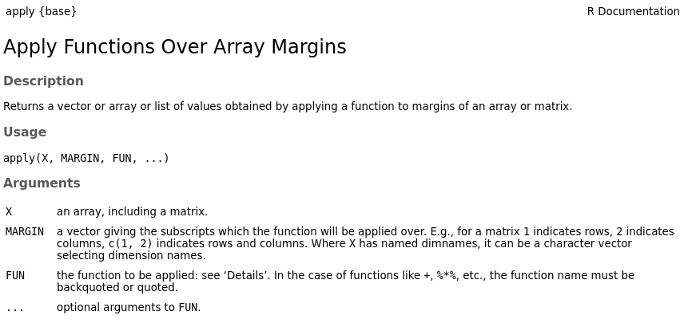

```{r, setup, child = "../setupFiles/_setup.Rmd", include = FALSE, purl = FALSE, cache = FALSE}
```

```{r, include = FALSE}
opts_chunk$set(echo = TRUE)
```

## Programming in R

In this practical we will explore how to **program** in R. Specifically we will look at:

* Looping e.g. `for`/`while` loops.
* Conditional statements e.g. `if`/`else`.
* User-defined functions.
* The `apply()` family of functions.

Many of these ideas should be familiar to you from pre-requisite modules, but we will revise them and see R's specific syntax.

## Loops

R has native support for both `for` and `while` loops:

`r bcols("t")`
`r bcol(0.48)`

```{r}
for(i in 1:4) {
    print(i)
}
```

`r ecol()`
`r bcol(0.48)`

```{r}
i <- 1
while(i < 5) {
    print(i)
    i <- i + 1
}
```

`r ecol()`
`r ecols()`

This is very useful to allow a piece of code to be executed repeatedly.

## Loops

Note that loops can also operate across vectors e.g.

`r bcols("t")`
`r bcol(0.48)`

```{r}
simpsons <- c("marge", "homer", 
    "bart", "lisa", "maggie")
for(i in simpsons) {
    print(i)
}
```

`r ecol()`
`r bcol(0.48)`

```{r}
simpsons <- c("marge", "homer", 
    "bart", "lisa", "maggie")
for(i in 1:length(simpsons)) {
    print(simpsons[i])
}
```

`r ecol()`
`r ecols()`

## Conditional statements

Conditional statements are also fundamental to computer programming e.g.

`r bcols("t")`
`r bcol(0.45)`

```{r, size = "smaller"}
simpsons <- data.frame(
    name = c("marge", "bart", 
        "lisa", "maggie", "homer"),
    age_chr = c("grown-up", 
        rep("child", 3), "grown-up")
)
simpsons
```

`r ecol()`
`r bcol(0.51)`

```{r, size = "smaller"}
for(i in 1:nrow(simpsons)) {
    if(simpsons$age_chr[i] == "grown-up") {
        print(paste(simpsons$name[i], 
            "is a grown-up"))
    } else {
        print(paste(simpsons$name[i], 
            "is a child"))
    }
}
```

`r ecol()`
`r ecols()`

## Conditional statements

Remember there are often many ways to approach a specific problem...

```{r}
for(i in 1:nrow(simpsons)) {
    print(paste(simpsons$name[i], "is a", simpsons$age_chr[i]))
}
```

```{r}
paste(simpsons$name, "is a", simpsons$age_chr)
```

## Your turn

Work your way through Sections 3.1--3.2.

## User-defined functions

A really important aspect of programming is the ability to write **user-defined functions**.

These allow you to write **custom** code which can then be applied multiple times with different inputs. For example:

```{r}
x <- rnorm(10, 0, 1)
x
prop_gt_half <- function(x) {
    y <- x[x > 0.5]
    p <- length(y) / length(x)
    print(paste0(round(p * 100, 2), "% of entries are > 0.5"))
}
prop_gt_half(x)
```

## User-defined functions

```{r}
x <- rnorm(10, 0, 1)
x
prop_gt_half(x)
x <- rnorm(10, 0, 1)
x
prop_gt_half(x)
```

## User-defined functions

```{box, wrap = TRUE}
Note that variables in functions are treated as **local** variables (i.e. they exist only within the function itself).
```

```{r}
test_fn <- function(x) {
    x <- x + 1
    return(x)
}
x <- 1
test_fn(x)
x
x <- test_fn(x)
x
```

## User-defined functions

You can also add additional inputs (arguments) and can set **defaults** e.g.

```{r}
prop_gt <- function(x, thresh = 0.5) {
    y <- x[x > thresh]
    p <- length(y) / length(x)
    print(paste0(round(p * 100, 2), "% of entries are > ", thresh))
}
x <- rnorm(10, 0, 1)
x
prop_gt(x)
```


## User-defined functions

```{r}
prop_gt(x, thresh = 0.9)
prop_gt(x, thresh = 0.1)
```

## User-defined functions

As usual these use **positional** matching unless arguments are specifically **named**:

```{r}
prop_gt(x, 0.9)
prop_gt(thresh = 0.9, x = x)
prop_gt(0.9, x)
```

## User-defined functions

We can protect against certain odd behaviours by adding **checks** of arguments into our functions`r footnotemark()`:

```{r, error = TRUE, size = "smaller"}
prop_gt <- function(x, thresh = 0.5) {
    if(!is.numeric(x) | !is.numeric(thresh)) {
        stop("'x' and 'thresh' must both be numeric")
    }
    if(length(thresh) != 1) {
        stop("'thresh' must be of length 1")
    }
    y <- x[x > thresh]
    p <- length(y) / length(x)
    print(paste0(round(p * 100, 2), "% of entries are > ", thresh))
}
prop_gt(0.9, x)
```

```{r, error = TRUE, size = "smaller"}
prop_gt(x, thresh = TRUE)
```

`r if(is_latex_output()) br()`

```{footnotes}
this is **very useful** if we want to share our code with others, but can be quite useful even if we don't, to protect against our own numpty-ness...
```

## Your turn

Have a go at Section 3.3.

## R's `apply()` family of functions

There are several ubiquituous functions that you'll see used often in R code, I'll introduce four main ones
(though there are others): 

* `apply()`
* `lapply()` 
* `sapply()`
* `tapply()`

## `apply()`

`r benv("smaller")`

This applies a function to either rows or columns of a `matrix` (in fact it applies to any dimension of an `array`, but we will restrict ourselves here to `matrix` types here)`r footnotemark()` e.g.

```{r}
x <- rnorm(8, 0, 1)
x <- matrix(x, 2, 4)
x
apply(x, 1, mean)
apply(x, 2, mean)
```

`r ifelse(is_latex_output(), "\\vspace{\\baselineskip}", "")`

```{footnotes}
the first argument to `apply()` is the `matrix` object; the second (`MARGIN`) is (`1` = rows and `2` = columns); the third (`FUN`) is the function to apply to each margin
```

`r eenv("smaller")`

## `apply()`

```{r, include = FALSE}
prop_gt <- function(x, thresh = 0.5) {
    if(!is.numeric(x) | !is.numeric(thresh)) {
        stop("'x' and 'thresh' must both be numeric")
    }
    if(length(thresh) != 1) {
        stop("'thresh' must be of length 1")
    }
    y <- x[x > thresh]
    p <- length(y) / length(x)
    print(paste0(round(p * 100, 2), "% of entries are > ", thresh))
    NULL
}
```

We can also pass in **user-defined** functions as the `FUN` argument, which case the first argument of the function must be a `vector` e.g.

```{r}
apply(x, 1, prop_gt)
apply(x, 2, prop_gt)
```

## `apply()`

We can pass additional arguments to `FUN` by adding them as additional inputs to `apply()` e.g.

```{r}
apply(x, 1, prop_gt, thresh = 0.1)
apply(x, 2, prop_gt, thresh = 0.9)
```

## Aside: ellipsis (`...`) arguments

Notice that when we ran:

```{r, eval = FALSE}
apply(x, 1, prop_gt, thresh = 0.1)
```

the `apply()` function does not have an argument called `thresh`. Our **custom** function `prop_gt()` does however, and the `apply()` knows to pass `thresh = 0.1` through to `prop_gt()`. 

It only knows how to do this through the use of a special argument called the **ellipsis** argument, which is denoted by `...`.

```{r, echo = FALSE, out.width = "50%"}

```

## Aside: ellipsis (`...`) arguments

**Ellipsis** arguments are very useful, but need to be used with care! 

They can only be used if a corresponding function has been written to use them, and although they support positional matching, it is often helpful to be explicit and use **named** matching.

## `lapply()`

The `lapply()` function does a similar thing but applies a function to each element of a `list()`. **It always returns another `list`**. For example:

```{r}
x <- list(y = 1:3, z = 1:9)
x
lapply(x, length)
```

## `sapply()`

The `sapply()` function is the same as `lapply()`, except that it **tries to return simpler objects if it can**.

```{r}
lapply(x, length)
sapply(x, length)
```

**Be careful** to check the output of `sapply()` and make sure it matches to what you expect.

## `tapply()`

The `tapply()` function enables you to apply a function to **subsets** of given R objects (typically `vector` objects). The subsets are defined by an **indexing** vector; typically a `factor`/`character`.

`r bcols("t")`
`r bcol(0.48)`

```{r, size = "smaller"}
simpsons <- data.frame(
    name = c("marge", "bart", "lisa", 
        "maggie", "homer"),
    age_chr = c("grown-up", 
        rep("child", 3), "grown-up"),
    age = c(36, 10, 8, 1, 39)
)
simpsons
```

`r ecol()`
`r bcol(0.48)`

```{r, size = "smaller"}
tapply(simpsons$age, simpsons$age_chr, length)
tapply(simpsons$age, simpsons$age_chr, mean)
```

`r ecol()`
`r ecols()`

## Your turn

Have a go at Section 3.4.
