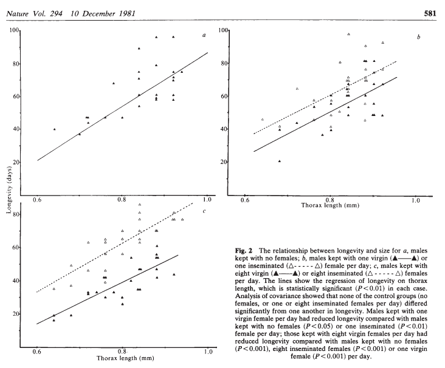
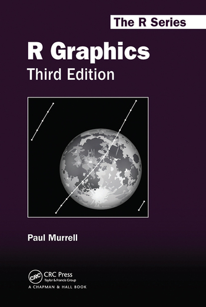

```{r, setup, child = "../setupFiles/_setup.Rmd", include = FALSE, purl = FALSE, cache = FALSE}
```

```{r, include = FALSE}
opts_chunk$set(echo = TRUE)
```

```{r, include = FALSE}
ff <- readRDS("ff.rds")
```

## Simple plots

R **objects** have particular **classes** (for example, `numeric` or `factor` types). Sometimes we wish to perform operations on these objects, such as **plotting** or **summarising**. Roughly:

* **class**: determines what the object ***is***,
* **methods**: determine what an object ***can do***.

Languages like Python follow **encapsulated object-orientated programming (OOP)** protocols. This means that all *methods* are *encapsulated* into the object itself. So we might use e.g. `object.plot()` or `object.summary()`.

R follows a **functional OOP** protocol, which means that there are **generic methods** (functions) that operate differently if different objects are passed to them. So we might use e.g. `plot(object)` or `summary(object)`.

## Simple plots

Not all functions are **generic**, but common ones include: `plot()`, `summary()`, `print()`, `[]` (subset).

This means that different objects can be passed to the `plot()` function say, and produce different outputs by default (as long as a `plot` method has been written for the specific object class) e.g.

`r bcols("t")`
`r bcol(0.48)`

```{r, out.width = "80%"}
plot(ff$thorax, ff$longevity)
```

`r ecol()`
`r bcol(0.48)`

```{r, out.width = "80%"}
plot(ff$partner.type, ff$longevity)
```

`r ecol()`
`r ecols()`

## Simple plots

Some objects have detailed `plot` methods, for example those leveraged in many of R's **statistical modelling** packages. Other times we may wish to develop our own plots using simple object types. We will look at a few examples in this session.

## Where we want to get to

[Partridge and Farquhar (1981)](https://www.nature.com/articles/294580a0)

```{r, echo = FALSE, out.width = "60%"}

```

## Fruitflies data

Does increased sexual activity affected the lifespan of male fruitflies?

```{r}
head(ff)
```

```{r}
summary(ff)
```

## Scatterplots

Scatterplots plot one **numerical** variable against another. 

```{r, fig.width = 6, fig.height = 5.5, out.width = "45%"}
ffc <- ff[ff$partner.type == "Control", ]
plot(ffc$thorax, ffc$longevity)
```

## Scatterplots

Axis labels can be tidied up with `xlab` and `ylab` arguments, and an overall header can be added with `main`:

```{r, fig.width = 6, fig.height = 5.5, out.width = "45%"}
plot(ffc$thorax, ffc$longevity, 
     xlab = "Thorax length (mm)", ylab = "Longevity (days)",
     main = "Figure 1")
```

## Scatterplots

There are various options we can change, including **point character** (`pch`) and **colour** (`col`):

```{r, fig.width = 6, fig.height = 5.5, out.width = "45%"}
plot(ffc$thorax, ffc$longevity, pch = 20, col = "red")
```

## Scatterplots

These options come into their own when passed `vector` objects, where each element corresponds to a specific `pch` or `col``r footnotemark()`. 

`r bcols()`
`r bcol(0.48)`

For example:

```{r, fig.width = 6, fig.height = 5.5, out.width = "45%", eval = FALSE}
ffone <- ff[ff$partners == "1", ]
ffcols <- ifelse(ffone$partner.type == 
    "Inseminated", "red", "black")
ffpch <- ifelse(ffone$partner.type == 
    "Inseminated", 20, 1)
plot(ffone$thorax, ffone$longevity, 
     pch = ffpch, col = ffcols)
```

`r ecol()`
`r bcol(0.48)`

```{r, fig.width = 6, fig.height = 5.5, out.width = "80%", echo = FALSE}
ffone <- ff[ff$partners == "1", ]
ffcols <- ifelse(ffone$partner.type == 
    "Inseminated", "red", "black")
ffpch <- ifelse(ffone$partner.type == 
    "Inseminated", 20, 1)
plot(ffone$thorax, ffone$longevity, 
     pch = ffpch, col = ffcols)
```

`r ecol()`
`r ecols()`

```{footnotes}
note that these vectors must be in the same order as the `x` and `y` inputs. There are also multiple ways to do this---please see practical for another example
```

## Scatterplots

Legends can be added manually using the `legend()` function.

```{r, fig.width = 6, fig.height = 5.5, out.width = "45%"}
plot(ffone$thorax, ffone$longevity, 
     pch = ffpch, col = ffcols)
legend(0.65, 95, pch = c(2, 20),
    col = c("black", "red"),
    legend = c("Virgin", "Inseminated"))
```

## Line plots

Similar functionality exists for drawing line plots. Here is a plot of monthly lung disease deaths in males in the UK from 1974--1979.

`r bcols()`
`r bcol(0.50)`

```{r, fig.width = 6, fig.height = 5.5, out.width = "45%", eval = FALSE}
plot(ldeaths$date[ldeaths$sex == "male"],
    ldeaths$deaths[ldeaths$sex == "male"],
    type = "l", lty = 1)
```

The argument `lty` allows you to change the line type (analogous to `pch` for scatterplots). There are also more `type` options, allowing for steps, or even both lines and points together. 

`r ecol()`
`r bcol(0.46)`

```{r, fig.width = 6, fig.height = 5.5, out.width = "80%", echo = FALSE}
ldeaths <- read.csv("ldeaths.csv")
ldeaths$date <- as.Date(ldeaths$date, format = "%Y-%m-%d")
plot(ldeaths$date[ldeaths$sex == "male"],
     ldeaths$deaths[ldeaths$sex == "male"],
     type = "l")
```

`r ecol()`
`r ecols()`

## Adding to existing plots

There are various useful functions, e.g. `points()`, `lines()` and `abline()``r footnotemark()` that enable us to add points or lines to an existing plot:

`r bcols()`
`r bcol(0.48)`

```{r, fig.width = 6, fig.height = 5.5, out.width = "45%", eval = FALSE}
plot(ffone$thorax, ffone$longevity, 
    pch = 20)
ffinds <- 
    ffone$partner.type == "Inseminated"
points(ffone$thorax[ffinds], 
    ffone$longevity[ffinds],
    col = "red",
    pch = 20)
```

`r ecol()`
`r bcol(0.48)`

```{r, fig.width = 6, fig.height = 5.5, out.width = "80%", echo = FALSE}
plot(ffone$thorax, ffone$longevity, pch = 20)
points(ffone$thorax[ffone$partner.type == "Inseminated"], 
    ffone$longevity[ffone$partner.type == "Inseminated"],
    col = "red",
    pch = 20)
```

`r ecol()`
`r ecols()`

```{footnotes}
amongst others: `hline()`, `vline()` etc.
```

## Adding to existing plots

`r bcols()`
`r bcol(0.58)`

```{r, fig.width = 6, fig.height = 5.5, out.width = "45%", eval = FALSE}
plot(ldeaths$date[ldeaths$sex == "male"],
    ldeaths$deaths[ldeaths$sex == "male"],
    type = "l", xlab = "Date", 
    ylab = "Number of deaths",
    ylim = c(400, 3000))
lines(ldeaths$date[ldeaths$sex == "female"],
    ldeaths$deaths[ldeaths$sex == "female"],
    lty = 2)
legend(
    as.Date("01-01-1978", format = "%d-%m-%Y"), 
    3000, lty = 1:2,
    legend = c("Male", "Female"))
```

`r ecol()`
`r bcol(0.38)`

```{r, fig.width = 6, fig.height = 5.5, out.width = "90%", echo = FALSE}
plot(ldeaths$date[ldeaths$sex == "male"],
    ldeaths$deaths[ldeaths$sex == "male"],
    type = "l", xlab = "Date", 
    ylab = "Number of deaths",
    ylim = c(400, 3000))
lines(ldeaths$date[ldeaths$sex == "female"],
    ldeaths$deaths[ldeaths$sex == "female"],
    lty = 2)
legend(as.Date("01-01-1978", format = "%d-%m-%Y"), 3000, lty = 1:2,
    legend = c("Male", "Female"))
```

`r ecol()`
`r ecols()`

## Your turn

Have a go at Section 4.1.

## Arranging plots

It is also possible to arrange multiple plots. There are various packages that offer more flexibility, but in most cases setting `par(mfrow = c(NROWS, NCOLUMNS))` is sufficient. Once this is set then plots are printed left-to-right and top-to-bottom e.g.

`r bcols()`
`r bcol(0.38)`

```{r, eval = FALSE}
par(mfrow = c(2, 2))
plot(CONTROLS CODE)
plot(ONE PARTNER CODE)
plot(EIGHT PARTNER CODE)
par(mfrow = c(1, 1))
```

`r ecol()`
`r bcol(0.58)`

```{r, fig.width = 7, fig.height = 7, out.width = "80%", echo = FALSE}
## set up 2 x 2 grid of plots
## (mfrow takes a vector with number of
## rows and number of columns)
par(mfrow = c(2, 2))
## plot controls
plot(ffc$thorax, ffc$longevity, pch = 20,
xlab = "Thorax length (mm)",
ylab = "Longevity (days)",
main = "Controls",
xlim = range(ff$thorax),
ylim = range(ff$longevity))
titles <- c("One partner", "Eight partners")
partners <- c("1", "8")
for(i in 1:length(titles)) {
## extract subset of data
temp <- ff[ff$partners == partners[i], ]
## create vector of initial point characters
temp_pch <- rep(20, nrow(temp))
## turn off point characters for all entries not
## in the virgin
temp_pch[temp$partner.type != "Virgin"] <- 1
## produce plot (notice that only the controls are plotted
## but the axes are correct)
plot(temp$thorax, temp$longevity,
xlab = "Thorax length (mm)",
ylab = "Longevity (days)",
main = titles[i],
xlim = range(ff$thorax),
ylim = range(ff$longevity),
pch = temp_pch)
## add legend
legend(0.65, 95, pch = c(20, 1), legend = c("Virgin", "Inseminated"))
}
## reset par
par(mfrow = c(1, 1))
```

`r ecol()`
`r ecols()`

## Your turn

Have a go at Section 4.2.

## Flexibility

There are many, many other features of R's graphics capabilities that can be leveraged to produce complex and detailed plots. A good book is [R Graphics](https://www.routledge.com/R-Graphics-Third-Edition/Murrell/p/book/9780367780692) by Paul Murrell.

`r bcols()`
`r bcol(0.48)`

```{r, out.width = "50%", echo = FALSE}

```

`r ecol()`
`r bcol(0.48)`

We will introduce a powerful package in the next session called [`ggplot2`](https://ggplot2.tidyverse.org/) which offers an easier way to create *certain types* of complex graphics that is especially well-suited to visualising `data.frame` objects`r footnotemark()`.

`r ecol()`
`r ecols()`

```{footnotes}
it is worth noting that underneath-the-hood \newline`ggplot2` is all written using base R graphics
```

## Other plots

Since `plot()` in R is a **generic function**, you can often plot different objects and they produce specialist plots, or there are specific plot functions such as `hist()` or `barplot()`.

`r bcols("t")`
`r bcol(0.48)`

```{r}
plot(density(ff$thorax))
```

`r ecol()`
`r bcol(0.48)`

```{r}
hist(ff$thorax)
```

`r ecol()`
`r ecols()`

## Your turn

Have a go at Section 4.3


