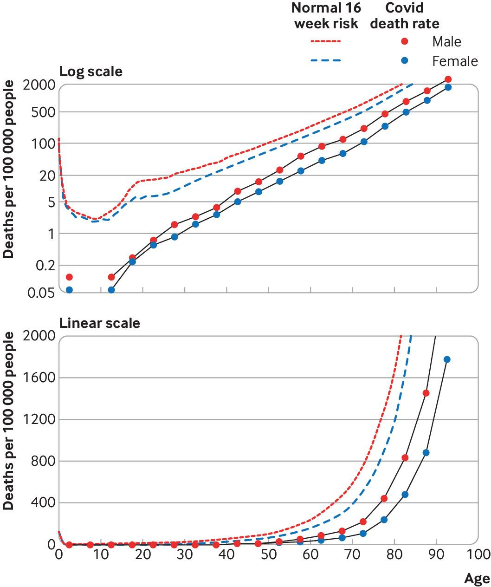
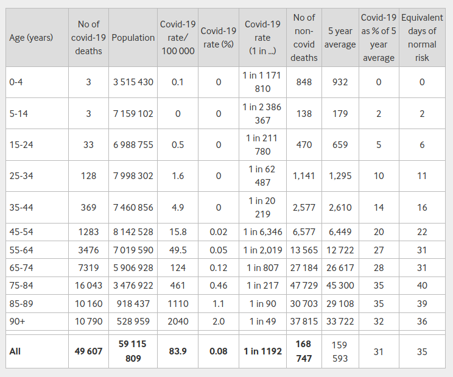
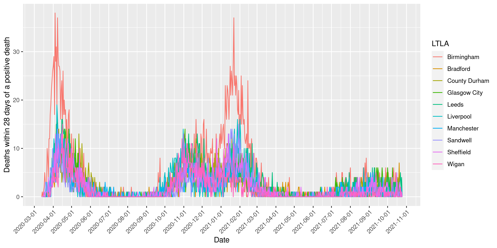
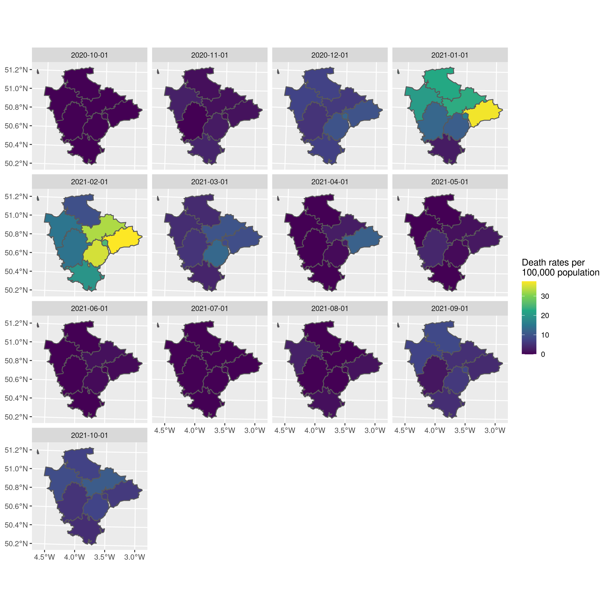
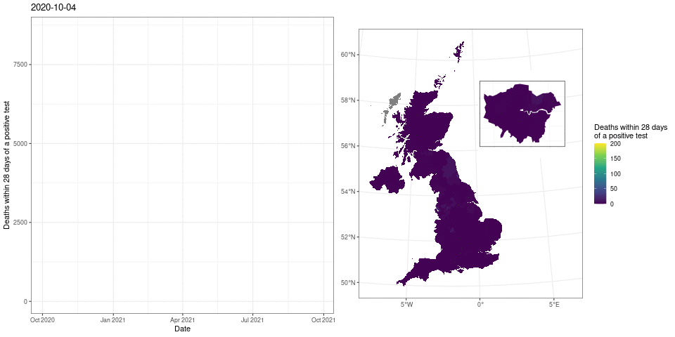
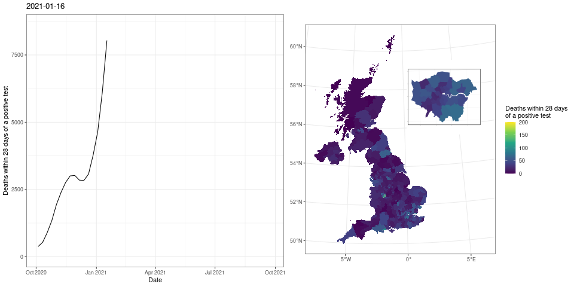

```{r, setup, child = "../setupFiles/_setup.Rmd", include = FALSE, purl = FALSE, cache = FALSE}
```

```{r, include = FALSE}
opts_chunk$set(echo = TRUE)
```

## Spatial mapping of COVID-19 deaths

In the last workshop you saw different ways of producing **population fatality risk** estimates for COVID-19 in England and Wales, using the method in Spiegelhalter (2020).

`r bcols("t")`
`r bcol(0.48)`

```{r, echo = FALSE, out.width = "60%"}

```

`r ecol()`
`r bcol(0.48)`


```{r, echo = FALSE, out.width = "70%"}

```

`r ecol()`
`r ecols()`

`r benv("smaller")`

[Spiegelhalter D. Use of "normal" risk to improve understanding of dangers of covid-19, *BMJ*, 2020; 370 :m3259](https://www.bmj.com/content/370/bmj.m3259).

`r eenv("smaller")`

## Spatial mapping of COVID-19 deaths

Here we will implement the same ideas, but this time exploring variations in death rates over space and time. We can download **daily** COVID-19 death data for all Lower Tier Local Authority (LTLA) regions (358 here). We can explore time-series plots, stratified by spatial locations e.g.

```{r, echo = FALSE, out.width = "70%"}

```

## Spatial mapping of COVID-19 deaths

We can also produce plots using **spatial shapefiles**. These files contain coordinates that define the shape of each spatial region. Whilst shapefiles contain complex information, a recent package called `sf` allows them to be read into R and stored as `tibble` objects, where the spatial polygons are stored as a special `geometry` column.

This means we can manipulate these objects using the usual `tidyverse` approaches. There is also a special geom in `ggplot2` called `geom_sf()` that can plot these spatial regions, which can have `colour` and `fill` aesthetics mapped in the usual way.

## Spatial mapping of COVID-19 deaths

Here is a map of monthly death rates from COVID-19 in Devon between October 2020 and October 2021 (so through the second wave and now into the third). Rates are expressed in the same units as Spiegelhalter (2020).

```{r, echo = FALSE, out.width = "50%"}

```

## Spatial mapping of COVID-19 deaths

As a final example, we can also combine time-series and spatial information into bespoke animations (though this latter part is not trivial and is thus included as an additional example if you are interested).

```{r, echo = FALSE, out.width = "70%", eval = ifelse(is_latex_output(), FALSE, TRUE)}

```

```{r, echo = FALSE, out.width = "70%", eval = ifelse(is_latex_output(), TRUE, FALSE)}

```

